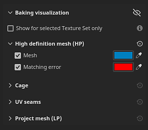
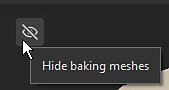

# Baking visualization settings

The Baking visualization is a panel inside Painter's Viewport while in Baking mode. It allows you to adjust settings related to the display of meshes in the Viewport.

## General settings

| Setting | Description |
| --- | --- |
| **Hide baking meshes** | If enabled, this icon will hide the high poly and cage mesh in the viewport. 

 |
| **Show for selected Texture Set only** | If enabled, only the cage and high-poly meshes of the currently active Texture Set will be visible in the viewport. |

### High definition mesh (HP)

| Setting | Description |
| --- | --- |
| <b>Mesh</b> | If enabled, display the high-poly meshes in the 3D view. When disabled, high-poly meshes are also unloaded from memory and can help improve performance. Use the color option next to this setting to control the mesh surface color in the viewport. |
| <b>Matching error</b> | If enabled, display areas of the high-poly meshes that are outside the shell of the cage mesh in the given color. This setting helps identify areas that will be missed during the baking process and could result in loss of details/information. Use the color option next to this setting to control the color of intersecting areas in the viewport. |

### Cage

| Setting | Description |
| --- | --- |
| <b>Cage surface</b> | If enabled, the cage mesh surface will be displayed in the 3D view. The surface of the cage is defined by the color button next to the setting. |
| <b>Cage surface opacity</b> | Make the mesh more or less transparent to manage visibility of details in the underlying mesh. |
| <b>Cage wireframe</b> | If enabled, the wireframe of the cage mesh will be visible in the Viewport. The wireframe color can be adjusted with the color button next to this setting. |
| <b>Cage wireframe opacity</b> | Make the wireframe more or less transparent. |

### UV seams

| Setting | Description |
| --- | --- |
| <b>Missing seams on hard edges</b> | If enabled, hard edges on the surface of the mesh that are not UV seams will be highlighted with the color defined by the button next to the setting. Highlighted edges are only visible on the cage and low-poly mesh. Edges can be seen in both the 2D and 3D views. This setting helps identify edges that have split vertex normals without a UV unwrapping seam, which could lead to baking issues later on. |

### Project mesh

<table data-preserve-html="true">
<colgroup><col/><col/><col/></colgroup><tbody><tr><th scope="col">Setting</th>
<th scope="col">Secondary setting</th>
<th scope="col">Description</th>
</tr><tr><td><b>Project mesh</b></td>
<td> </td>
<td>
If enabled, the low-poly meshes on which the high-poly meshes are baked will be visible in the Viewport. If <b>Hide baking meshes</b> is enabled, this setting is automatically enabled as well to avoid an empty viewport.

Use the color option next to this setting to adjust the color of the Project mesh.

</td>
</tr><tr><td rowspan="7"><b>Neutral material</b></td>
<td><b>Quality</b></td>
<td>Controls the specular reflection quality on the surface of the low-poly mesh. Using a high value will give better fidelity in the reflections, however a high value can impact performance. A low value can introduce seams in the shading with normal maps (Note: this is only a display issue).</td>
</tr><tr><td><b>Roughness</b></td>
<td>Controls the roughness of the low-poly mesh material in the viewports.</td>
</tr><tr><td><b>Metallic</b></td>
<td>Controls the metalness of the low-poly mesh material in the viewports.</td>
</tr><tr><td><b>AO intensity</b></td>
<td>Controls how much the baked Ambient Occlusion contributes to the low-poly mesh shading in the Viewport.</td>
</tr><tr><td><b>Bent normal</b></td>
<td>If enabled, use baked Bent Normals to improve the low-poly mesh shading in the Viewport.</td>
</tr><tr><td><b>Bent normal diffuse amount</b></td>
<td>Controls how much the Bent Normals affect the diffuse shading.</td>
</tr><tr><td><b>Bent normal specular amount</b></td>
<td>Controls how much the Bent Normals affect the specular shading.</td>
</tr></tbody></table>
