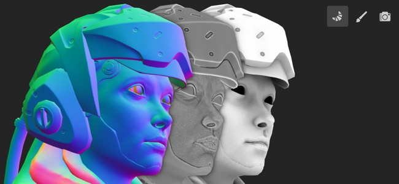

# Baking

Baking refer to the action of **transferring mesh based information into textures**. These information are then read by shaders and/or Substance filters to perform advanced effects. For example Smart Materials and Smart Masks rely on them.

In Painter baking is done via the dedicated Baking Mode. This mode can be accessed via the dedicated icon (little croissant in the contextual toolbar), by using the [mode menu](../help/interface/main-menu/mode-menu/mode-menu.md), or by using the [keyboard shortcut](../help/interface/settings/shortcuts/shortcuts.md).

To learn more about the baking process in Painter, see the following pages:

* [How to bake mesh maps](../help/baking/how-to-bake-mesh-maps/how-to-bake-mesh-maps.md)
* [Baking visualization settings](../help/baking/baking-visualization-set/baking-visualization-settings.md)

For a quick overview of the Baking mode, check out our video tutorial:

>[!NOTE]
>
> To learn more about baking in general, take a look at the dedicated [Baking Documentation](https://helpx.adobe.com/substance-3d-bake/home.html).
