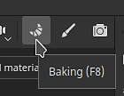
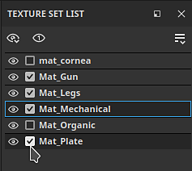
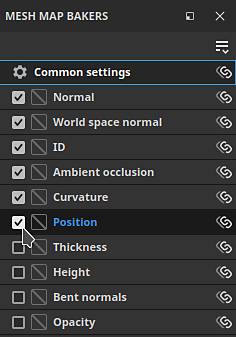
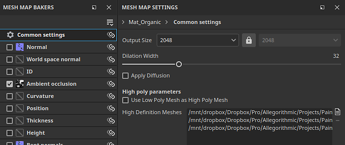
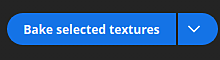
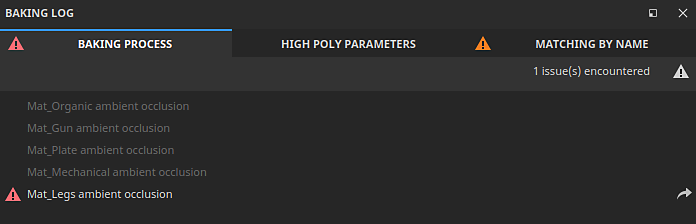

# How to bake mesh maps

Substance 3D Painter's dedicated baking mode makes it easy to bake mesh maps that can power awesome smart materials and other tools. Read on, or watch the video below to learn how to start baking with Substance 3D Painter.

## 1 - Switch to baking mode

By default, Painter starts in Painting mode when creating or opening a project. To be able to bake mesh maps, you need to switch to Baking mode. Use one of the following options to switch to Baking mode:

* Use the <b>Baking mode button</b> (<b>Croissant icon</b>) in the contextual Toolbar at the top right of the Viewport

  

  >[!NOTE]
  >
  > Sometimes the <b>Baking mode button</b> can be hidden behind other panels depending on your workspace layout.
* Use the Mode menu and select <b>Bake mesh maps.  
  </b>
* Use the <b>F8</b> keyboard shortcut.

### 2 - Select Texture Sets and UV Tiles

Inside the <b>Texture Set list</b>, use the checkbox next to each Texture set (and UV Tiles number if present) to select which parts to bake:

### 3 - Select bakers

Inside the Mesh Map Bakers window, use the check boxes to select the maps that you want to be baked:

### 4 - Change common settings

In the Mesh map bakers panel, click on the common settings to change the settings like baked map resolution, dilation width, and high poly parameters, that are shared across all maps:

In the common settings, you can define which files to be used as high definition meshes. Selecting high definition meshes allows you do define how the cage is generated for your meshes:

* Distance based: Inflate the vertices away from the mesh a uniform distance across the model to create a cage.
* Automatic (experimental): Painter will analyse your mesh and generate a cage automatically, trying to keep the cage close to the surface without creating intersections for best results.
* Custom file: Import a file that you have created to use as the cage. Note that imported files must have the same number of vertices as the base mesh to work correctly.

If you are not baking from a high-poly mesh, enable the <b>Use Low Poly Mesh as High Poly Mesh</b> checkbox instead.

### 5 - Adjust the cage

Different options are available to adjust the cage based on which cage method you're using. With a distance-based cage, you can adjust the Frontal and Rear distances to minimise the amount of intersection between the cage and your mesh.

>[!NOTE]
>
> Red spots appear when the cage intersects with the model's geometry. An intersecting cage generally leads to artifacts and issues in the intersecting area.

### 6 - Start the baking process

At the bottom of the viewport, click on the Bake button to start the baking process.

### 7 - Inspect the Baking Log for errors

Once the baking process has finished, you can take a look at the Baking Log window to check if there are any errors reported.

If there are any, use the arrow next to the error message to view the relevant baker settings:

