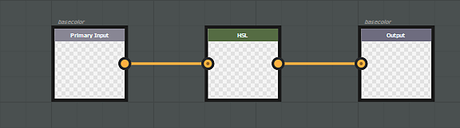
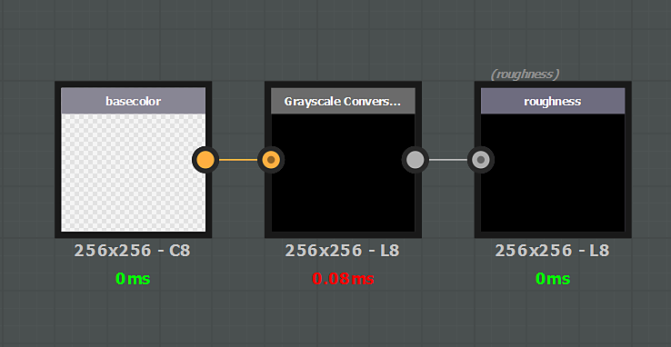
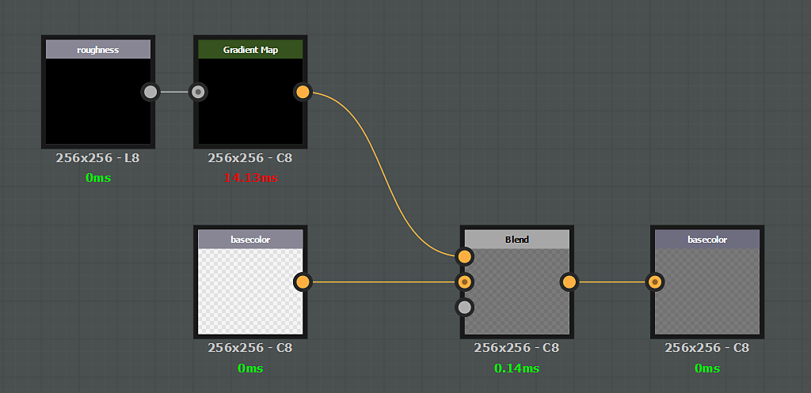

# Channel specific filter

An effect can be specific to a particular channel. In that case, if you want to affect a specific channel, you need to create an input AND an output which identifies this channel. As a general rule, the input / output structure should always respect a 1:1 rule. If you want to input a specific channel, you have to output the same channel.

Example of a filter affecting the **basecolor** channel only :

>[!NOTE]
>
> It is not possible to combine generic setup (input/output nodes) and specific channels (basecolor/basecolor).

## Alpha component management

Channels stored as RGBA support alpha (basecolor for instance). For these channel, the alpha Input/Output can be stored directly in the Substance color output. However, the Substance engine does not support Alpha for grayscale images: it has to be managed using a secondary map. To get the alpha component of a specific channel in a substance graph, create a grayscale input named '**channelname\_Alpha**', example: **basecolor\_Alpha**, **roughness\_Alpha** and so on.  
To output this alpha component, create an output node with the same name convention.

>[!NOTE]
>
> The specific "**\_Alpha**" output per channel doesn't work with regular **materials**. To hide a channel with a mask, a specific output must be created with the following naming convention :
> 
> * Identifier : **channels\_Alpha**
> * Usage : **channels\_Alpha**

## List of input/output usages and identifiers

>[!NOTE]
>
> It is possible to use either the **usage** or the **identifier** in an input node (the usage has the priority).

| Channel name | Usage | Identifier / Identifier Alpha |
| --- | --- | --- |
| *Ambient Occlusion* | **ambientOcclusion** | **ambientOcclusion / ambientOcclusion\_Alpha** |
| *Anisotropy Angle* | **anisotropyangle** | **anisotropyAngle / anisotropyAngle\_Alpha** |
| *Anisotropy Level* | **anisotropylevel** | **anisotropyLevel / anisotropyLevel\_Alpha** |
| *Base Color* | **basecolor** | **baseColor / baseColor\_Alpha** |
| *Blending Mask* | **blendingmask** | **blendingmask / blendingmask\_Alpha** |
| *Diffuse* | **diffuse** | **diffuse / diffuse\_Alpha** |
| *Displacement* | **displacement** | **displacement / displacement\_Alpha** |
| *Emissive* | **emissive** | **emissive / emissive\_Alpha** |
| *Glossiness* | **glossiness** | **glossiness / glossiness\_Alpha** |
| *Height* | **height** | **height / height\_Alpha** |
| *IOR* | **ior** | **ior / ior\_Alpha** |
| *Metallic* | **metallic** | **metallic / metallic\_Alpha** |
| *Normal* | **normal** | **normal / normal\_Alpha** |
| *Opacity* | **opacity** | **opacity / opacity\_Alpha** |
| *Reflection* | **reflection** | **reflection / reflection\_Alpha** |
| *Roughness* | **roughness** | **roughness / roughness\_Alpha** |
| *Scattering* | **scattering** | **scattering / scattering\_Alpha** |
| *Specular* | **specular** | **specular / specular\_Alpha** |
| *Specular Level* | **specularlevel** | **specularLevel / specularLevel\_Alpha** |
| *Transmissive* | **transmissive** | **transmissive / transmissive\_Alpha** |
| *User 0* | **user0** | **user0 / user0\_Alpha** |
| *User 1* | **user1** | **user1 / user1\_Alpha** |
| *User 2* | **user2** | **user2 / user2\_Alpha** |
| *User 3* | **user3** | **user3 / user3\_Alpha** |
| *User 4* | **user4** | **user4 / user4\_Alpha** |
| *User 5* | **user5** | **user5 / user5\_Alpha** |
| *User 6* | **user6** | **user6 / user6\_Alpha** |
| *User 7* | **user7** | **user7 / user7\_Alpha** |

## Examples

{width="650px"}

In this example the Base Color alpha channel is extracted via a grayscale node to overwrite the **Roughness** channel.

{width="650px"}

In this example the **Roughness** channel is multiplied over the **Base Color**.
