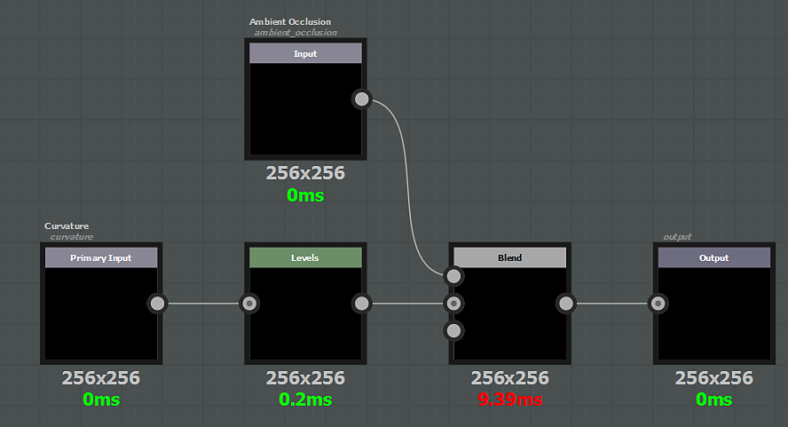

# Generators

A generator behave like a filter, the difference is that there is no input node other than the additional maps. If you need to read a channel from the texture set, then you want to make a filter.

