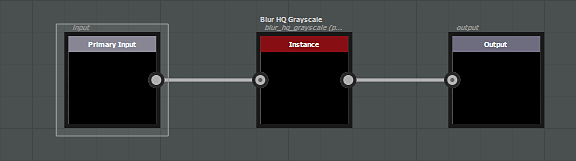
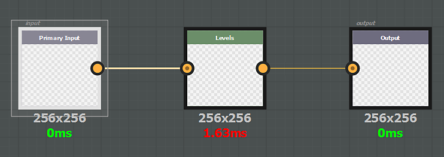

# Generic filter

A generic effect will be applied on all the document channels, including opacity. A generic filter can be :

* **grayscale**, it will be applied to each component (R, G, B and A) of each channel (basecolor, metallic, roughness and so on)
* **color**, it will be applied on colored channel as-is, or converted to grayscale internally to affect grayscale channels

The input node of the effect must have the **identifier** or **usage** defined **input** and its output node must have **output**. Note that **color** based fitlers can't be used on the mask of a layer, only **grayscale** fitlers will be compatible.

>[!NOTE]
>
> It is possible to use either the **usage** or the **identifier** in an input node (the usage has the priority).

Example :

{width="575px"}
