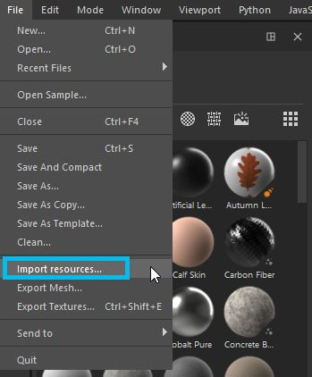
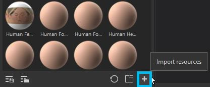
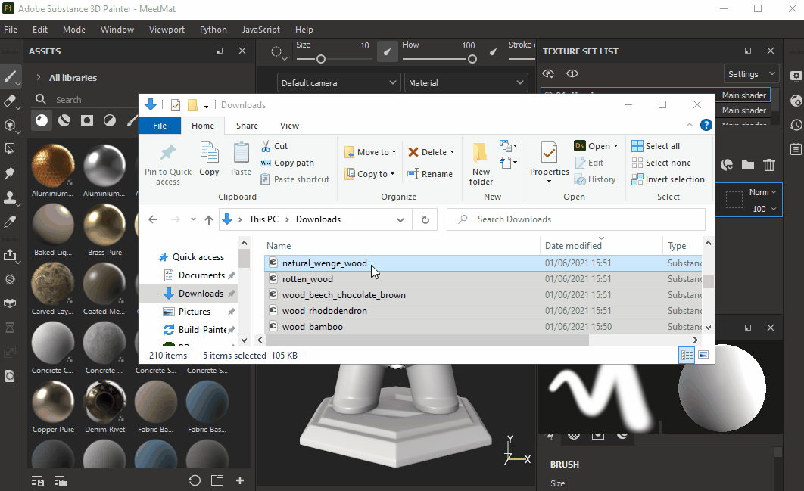
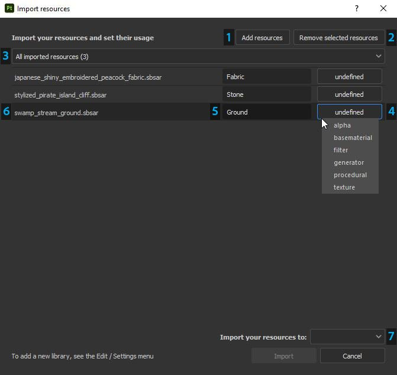

# Adding resources via the import window

## Opening the import window

There are three different ways to open the import window in Substance 3D Painter:

* Via the  **File &gt; Import resources...**  menu entry

* Via the  **dedicated button**  in the Assets window

* Via  **drag and drop**  of one or more files/folders into the Assets window

{width="700px"}

## Configuring the import window

* **1 - Add resources**: Allows to select additional files to import, which will add them to the list display in the Import window.
* **2 - Remove selected resources:** Removes files selected in the list.
* **3 - Dropdown filter**: Allow to filter the list of files by usage. This is useful to isolate resources that have the 'undefined' type.
* **4 - Usage**  : There are several different usage types available. The list of usages proposed may change according to the file format you are importing. Usage may be preselected for your file if your file format only has one usage type (for example, Painter presets .sppr will automatically be defined as such) OR if it's been pre-defined in the original Designer graph by its creator.
* **5 - Prefix**  : The prefix can be a folder path to define where to store a resource.
* **6 - Filename**  : Name of the current resource. Sometimes the folder where the resource was stored can be indicated, this information won't be used during the import process.
* **7 - Import location**  : Can be either -
  * **Current session**  : Into a temporary session, resources will be lost after a restart of the application.
  * **Project "project name"**  : Into the currently opened project file. Resources are embedded in the  **spp**  file.
  * **Shelf "shelf name"**  : Into the current library defined as writable. See this page for more information : [Libraries configuration](../../../interface/settings/libraries-configuration/libraries-configuration.md).

You can multi-select resources in the import window (using the usual system shortcuts) to quickly edit their usage.
