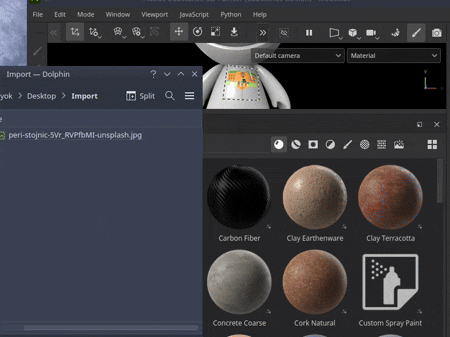
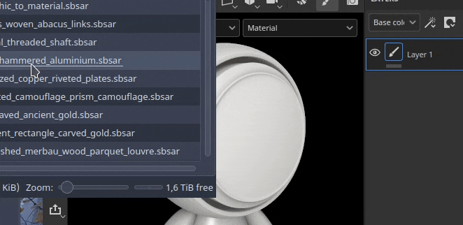
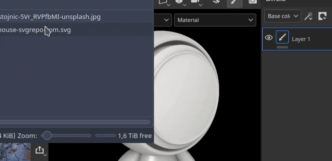
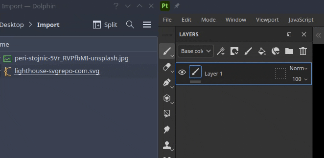
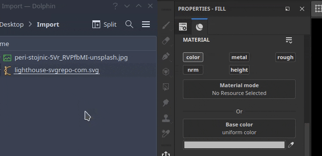

# Adding resources via drag and drop

Importing resources can be done simply by drag and dropping a file from outside the application into different areas of the interface.

## Importing into the Assets window

To import a resource into Painter, simply drag and drop it into the Assets window.

This will open the Improt resource window which allow to control where to put the resource (inside the project, on the disk for re-use across projects or in the session for a temporary usage). This window also allows to configure properly the usage of a resource, as sometimes some file format can be ambiguous.

### Importing into the viewport

To import and apply directly a material into your project, simply drag and drop it into the viewport. While dragging the file it should highglith the mesh to indicate on which part of the project it will be applied to.

It is also possible to import an SVG file by drag and dropping it into the viewport. Doing so will create a new layer with the warp projection mode and the reosurce <b>Graphic to Material</b>, making it handy to create decals.

### Importing into the layer stack

Drag and dropping a resource into the layer will create layers (or effects) when dropped. A menu may appears to ask in which channel to put the resource if it is not a Substance materials or filter.

### Importing into a resource slot

Drag and dropping a file into one of the resource slots in the interface, like for example into a channel inside a fill layer, will import the resource and apply it automatically.

