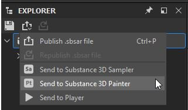
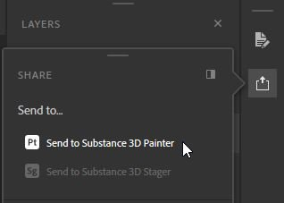

# Receiving assets from other Substance 3D applications

Starting with the 7.2.0 release, you can also receive and update assets sent from Designer and Sampler via the Send to feature. As you need to be able to access Sampler and Designer for this, this feature is only available if you are using Painter via Substance 3D Texturing or Substance 3D Collection.

Once the asset is sent, it will appear in Painter's Assets panel, imported to the default library location on disk. You can also **update** sent assets if you have made any changes in Designer or Sampler **within the same session** (as long as neither of the apps had been closed).

## Sending an asset from Designer to Painter

1. In the Explorer panel, select your main package.
1. Click on the Publish dropdown menu (alternatively you can also right-click on the main package).
1. Select option **Send to Substance 3D Painter** (this will automatically launch Painter if it is not already open).
1. The sent asset will appear in the Assets window.

## Sending an asset from Sampler to Painter

1. In the right side toolbar, open the Share panel.
1. Click on **Send to Substance 3D Painter** (this will automatically launch Painter if it is not already open).
1. The sent asset will appear in the Asset window.

