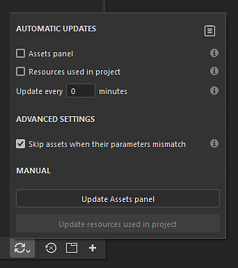
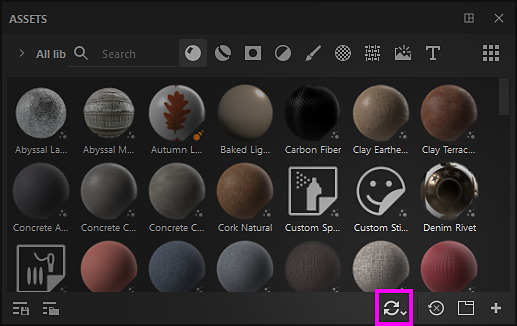
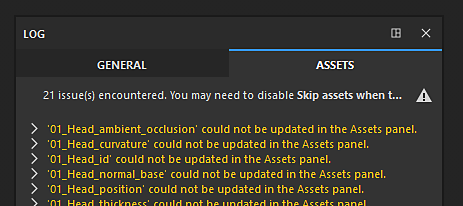
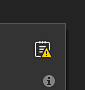
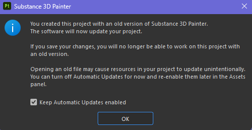

# Automatic resource update

The automatic resource update, or <b>auto-update</b>, is a feature of the [Assets window](../../interface/assets/assets.md) that allows to reload and updates resources when new versions are available. This process can be triggered automatically or manually in the interface, or via Python scripting.

## Tutorial

You can watch a quick tutorial to get an overview of the feature:

## Enabling auto-update

To enable the <b>auto-update</b> simply go to the bottom of the Assets window and click on the double arrows icon. This will open the auto-update menu with all its setting. Then enable one of the option available under the <b>automatic updates</b> section.

### Automatic updates

The automatic update settings control how often the application should look for updates and where.

| Setting | Description |
| --- | --- |
| <b>Assets panel</b> | If enabled, the auto-update will look for assets to update across all libraries currently loaded. This include the current project. However it won't update resources used in the layer stack, display settings, shader settings, etc. |
| <b>Resources used in project</b> | If enabled, the auto-update will look for assets to update that are currently imported and used by the current project. This applies to resources used in the layer stack, display settings, shader settings, etc. |
| <b>Update every x minutes</b> | Control how often the application look for an update of resources. A delay of 0 minutes will trigger an update every few seconds. Note that such a low delay can create performance issues. |

>[!NOTE]
>
> If automatic updates are enabled, the application will automatically look for changes each time it regains focus.

### Manual updates

The manual update actions are a convenient way to trigger the update system when desired. They can be used either with or without automatic update settings enabled.

| Setting | Description |
| --- | --- |
| <b>Update assets panel</b> | Start the auto-update process. Behave the same way as the <b>Assets panel</b> setting (see above). |
| <b>Update resources used in project</b> | Start the auto-update process. Behave the same way as the <b>Resources used in project</b> (see above). |

## Advanced settings

The advanced settings allow to control the behavior of the update process.

| Setting | Description |
| --- | --- |
| <b>Skip assets when their parameters mismatch</b> | If enabled, the auto-update process will avoid updating resources if the new version doesn't match the old version. For example if a Substance material has parameters that don't exist anymore in the new version (because they have been removed or renamed) the update process will ignore the resource and keep the old version instead. |

>[!NOTE]
>
> To force the update of assets that have a mismatch, you can disable the <b>Skip assets when their parameter mismatch</b> setting.

## Update status and log

After an update of resources happened (automatic or manual) the result of the process will appear inside the <b>Assets</b> tab in the <b>Log</b> window, reporting both successful updates and issues. In case of a resource mismatch (see above), the details of the issue we be provided per resource.

The log can be quickly opened by clicking on the dedicated icon at the top right of the auto-update menu:

>[!NOTE]
>
> When one or more issues appear after an update, the log icon will display a little warning icon.

Depending how the update process goes, several type of issues can appear:

| Issue | Description |
| --- | --- |
| <b>Could not be updated in Assets panel</b> | This message means a problem prevented the update system to proceed. Expand the resource name to get more information. |
| <b>(filename).(format) doesn&#39;t exists. Can&#39;t reload (resource name)</b> | This message means the source file of a resource cannot be found anymore (either because it moved or has been removed). A simple fix is to reimport the resource or relocate it in the Assets window (via the right-click menu). |

## Old project message

When opening an old project, an option will be available inside the popup message warning to inform about the auto-update process. This is a convenient way to quickly disable the auto-update process in case it stayed enabled before opening the old project.
