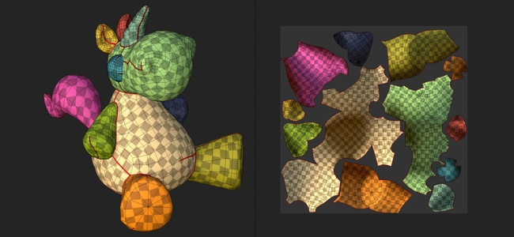
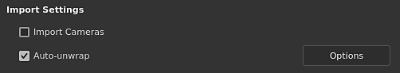
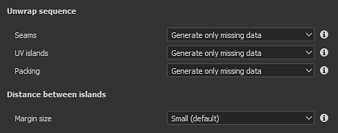

# Automatic UV Unwrapping

   
The automatic UV unwrapping allow to generate UV islands automatically when importing a 3D model. It can be used to paint on 3D model that don't have any existing UVs.

## Enabling the automatic UV unwrapping

When creating a new project or re-importing a mesh into an existing project, make sure the setting "Auto-unwrap" is checked. If disabled, the process will be skipped and mesh UVs will remain as-is.

## UV unwrapping settings

When importing a mesh and using the unwrapping process, the following settings are available. Some settings are available via the Options button in the interface.

| Section | ***Setting*** | ***Description*** |
| --- | --- | --- |
| **Unwrap sequence** | **Seams** | Controls if the seams (UV island borders) should be generated only for meshes that don't have them or always regenerated.Possible values:<ul data-preserve-html="true"><li data-preserve-html="true"><strong> Generate missing data </strong> (default): Seams will be generated for meshes missing them.</li><li data-preserve-html="true"><strong> Recompute all </strong> : Seams will be generated for all the meshes.</li></ul> |
| **UV islands** | Controls if the UV unwrapping should generated from meshes without UVs or for any meshes. Possible values:<ul data-preserve-html="true"><li data-preserve-html="true"><strong> Generate missing data </strong> (default): UV unwrapping will be generated for meshes missing UVs.</li><li data-preserve-html="true"><strong> Recompute all </strong> : UV unwrapping will be generated for all the meshes.</li></ul> |  |
| **Packing** | Controls the packing/layout of UV islands of the meshes.Possible values:<ul data-preserve-html="true"><li data-preserve-html="true"><strong> Generate missing data </strong> (default): pack UV islands for meshes that were missing UVs.</li><li data-preserve-html="true"><strong> Recompute all </strong> : pack all UV islands.</li></ul> |  |
|  |  |  |
| **Layout customization** | **Margin size** | Defines the spacing between UV islands. This setting applies a general percentage independent from the resolution.Possible values:<ul data-preserve-html="true"><li data-preserve-html="true"><strong> No margin </strong> : 0%</li><li data-preserve-html="true"><strong> Small </strong> (default): 0.2%</li><li data-preserve-html="true"><strong> Medium </strong> : 0.5%</li><li data-preserve-html="true"><strong> Large </strong> : 1%</li></ul> |
|  | **UV island orientation** | Control the orientation of the UV islands during the packing process.Possible values:<ul data-preserve-html="true"><li data-preserve-html="true"><strong>Unconstrained</strong> (default): no constrain is applied to compute the orientation.</li><li data-preserve-html="true"><strong>Align with 3D mesh</strong>: constrain the UV island to be oriented toward the mesh direction</li></ul> |
|  |  |  |
| **UV Tiles** | **Maximum number of UV Tiles** | If the UV Tiles workflow is enabled, this settings determine the maximum number of tiles to produce to distribute on the UV islands. |
|  |  |  |
| **Optimization** | **Avoid elongated UV islands** | If enabled, this process will split UV islands considered too long to improve the usage of the texture space.Example of before (top) and after (bottom): 

 |

## Known limitations

Below is a list of limitations related to the unwrapping process:

* Processing high poly meshes can take a long time.
* Vertices at the exact same coordinates are merged
* UV Generation may fail on some mesh parts in some rare cases
* Non uniform or highly distorted texel ratio in a single UV island in some cases
* Non uniform texel ratio between Texture Sets
* UV island generated can be very elongated and do not fit into UV space in some cases
* Degenerated faces or non-triangular mesh faces with small or overlapping edges may not get UV unwrapped
