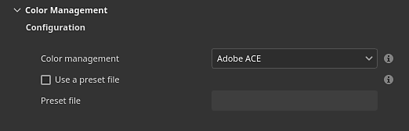
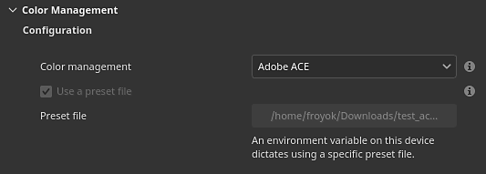

# Color management with Adobe ACE - ICC

This page lists the color management settings related to the Adobe Color Engine (ACE) to use image with ICC profiles.

## Project settings



The project settings can be set when creating a new project via the [new project](../../../getting-started/project-creation/project-creation.md) window or by using the [project configuration](../../../interface/project-configuration/project-configuration.md) window.

>[!NOTE]
>
> If an environment variable (see below) or a preset file is loaded, the settings in the UI will be disabled.

The available settings are:

| Section | Setting | Description |
| --- | --- | --- |
| **Configuration** | **Color management** | Define which engine to use to manage colors.Possible values:<ul data-preserve-html="true"> <li data-preserve-html="true"><strong>Legacy</strong> (default): Use the predefined sRGB/Linear sRGB gamma color correction.</li> <li data-preserve-html="true"><strong>OpenColorIO</strong>: Use OCIO integration.</li> <li data-preserve-html="true"><strong>Adobe ACE</strong>: Adobe Color Engine, to support ICC profiles.</li> </ul> |
|  | **Use a preset file** | If enabled, allow tod rive the color management settings via a json configuration file. |
|  | **Preset file** | Path to the preset file, in json format. For more details, see below. |
|  |  |  |
| **Color settings** | **Working color space** | The color space used by the engine to work inside the application. This the color space from which textures may be converted to (import) or from (export).Possible values are:<ul data-preserve-html="true"> <li data-preserve-html="true"><strong>Linear sRGB IEC61966-2.1</strong> (default)</li> <li data-preserve-html="true"><strong>ACEScg ACES Working Space AMPAS S-2014-004</strong></li> <li data-preserve-html="true"><strong>Linear Adobe RGB (1998)</strong></li> </ul> |
|  | **Rendering intent** | Specify the method used to convert color between color spaces.Possible values:<ul data-preserve-html="true"> <li data-preserve-html="true"><strong>Perceptual</strong></li> <li data-preserve-html="true"><strong>Saturation</strong> (default)</li> <li data-preserve-html="true"><strong>Relative chromatic</strong></li> <li data-preserve-html="true"><strong>Absolute chromatic</strong></li> </ul> |
|  |  |  |
| **Bitmap import color space defaults** | **8 bit images** | Color space to use by default when importing 8bit image files. |
|  | **16 bit images** | Color space to use by default when importing 16bit image files. |
|  | **Floating point images** | Color space to use by default when importing HDR/EXR image files. |
|  | **Use embedded ICC profiles when available (recommended)** | If enabled, use the ICC profiles since the image file to adjust their colors. |
|  |  |  |
| **Substance material** | **Material color space default** | Define which color space to use for Substance materials color managed input/output. |
|  |  |  |
| **Export color space** | **8 bit images** | Color space to use by default when exporting 8bit image files. |
|  | **16 bit images** | Color space to use by default when exporting 16bit image files. |
|  | **Floating point images** | Color space to use by default when exporting HDR/EXR image files. |

## Using a preset file



It  possible to use a preset file (in json format) to drive the ACE settings when creating new projects.

### Environment variable

The environment variable **PAINTER\_ACE\_CONFIG** can be used to specify the path of a preset file. If present, the application will always use a preset file to drive the Color management settings. The settings will be disabled in the interface.

For more details see the [Environment variables](../../../pipeline-and-integration/configuration/environment-variables/environment-variables.md) page.

### Preset example

Below is an example of a json file that can be used a preset file:

```

{ 

  "color settings": { 

    "working color space": "Linear Adobe RGB (1998)", 

    "rendering intent": "Saturation" 

  }, 

  "bitmap import color space defaults" : { 

    "8 bit images": "image P3", 

    "16 bit images": "image P3", 

    "floating point images": "Raw", 

    "use embedded ICC profiles when available": false 

  }, 

  "substance material": { 

    "material color space default": "image P3" 

  }, 

  "export colors spaces" : { 

    "8 bit images": "image P3", 

    "16 bit images": "image P3", 

    "floating point images": "Raw" 

  } 

} 


```
