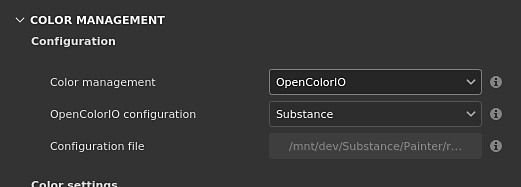

# Color management with OpenColorIO

This page lists the color management settings related to OpenColorIO (OCIO).

## Project settings

The project settings can be set when creating a new project via the [new project](../../../getting-started/project-creation/project-creation.md) window or by using the [project configuration](../../../interface/project-configuration/project-configuration.md) window.

>[!NOTE]
>
> If the **OCIO** environment variable is present, and specifies a valid configuration file, it will override and disable the settings in UI.

The available settings are:

<table data-preserve-html="true" style="width: 99.9039%;"><colgroup><col style="width: 12.512%;"/><col style="width: 21.1742%;"/><col style="width: 66.3122%;"/></colgroup><tbody><tr><th style="width: 12.5%;">Section</th><th style="width: 21.1538%;">Setting</th><th style="width: 66.25%;">Description</th></tr><tr><td rowspan="3" style="width: 12.5%;"><strong>Configuration</strong></td><td style="width: 21.1538%;"><strong>Color management</strong></td><td style="width: 66.25%;">
Define which engine to use to manage colors.

Possible values:
<ul><li><strong>Legacy</strong> (default): Use the predefined sRGB/Linear sRGB gamma color correction.</li><li><strong>OpenColorIO</strong>: Use OCIO integration.</li><li><strong>Adobe ACE</strong>: Adobe Color Engine, to support ICC profiles.</li></ul></td></tr><tr><td style="width: 21.1538%;"><strong>OpenColorIO configuration</strong></td><td style="width: 66.25%;">
Which configuration file to use to drive the color management settings.

Possible values:
<ul><li><strong>Substance</strong> (default): use Linear gamma as working space.</li><li><strong>ACES 1.0.3</strong>: use ACEScg as working space.</li><li><strong>ACES 1.2</strong>: use ACEScg as working space.</li><li><strong>Custom</strong>: use a custom configuration file.</li></ul></td></tr><tr><td style="width: 21.1538%;"><strong>Configuration file</strong></td><td style="width: 66.25%;">Path to the OCIO configuration file. Disabled if the configuration mode is not set to <strong>Custom</strong>.</td></tr><tr><th style="width: 12.5%;"> </th><th style="width: 21.1538%;"> </th><th style="width: 66.25%;"> </th></tr><tr><td rowspan="2" style="width: 12.5%;"><strong>Color settings</strong></td><td style="width: 21.1538%;"><strong>Working color space</strong></td><td style="width: 66.25%;">The color space used by the engine to work inside the application. This the color space from which textures may be converted to (import) or from (export).</td></tr><tr><td colspan="1"><strong>Standard sRGB color space</strong></td><td colspan="1">
The color space matching the [standard sRGB](https://en.wikipedia.org/wiki/SRGB) color space (IEC 61966-2-1:1999).

This color space is used in several places inside the application:
<ul><li>To convert color set in the hexadecimal field of the color picker.</li><li>To save and load color swatches within the color picker.</li><li>To be listed as a Display in the color picker list.</li></ul></td></tr><tr><th style="width: 12.5%;"> </th><th style="width: 21.1538%;"> </th><th style="width: 66.25%;"> </th></tr><tr><td rowspan="4" style="width: 12.5%;"><strong>Bitmap import color space defaults</strong></td><td style="width: 21.1538%;"><strong>8 bit images</strong></td><td style="width: 66.25%;">Color space to use by default when importing 8bit image files.</td></tr><tr><td style="width: 21.1538%;"><strong>16 bit images</strong></td><td style="width: 66.25%;">Color space to use by default when importing 16bit image files.</td></tr><tr><td style="width: 21.1538%;"><strong>Floating point images</strong></td><td style="width: 66.25%;">Color space to use by default when importing HDR/EXR image files.</td></tr><tr><td style="width: 21.1538%;"><strong>Auto detect color spaces</strong></td><td style="width: 66.25%;">
Allow to define the color space from resources based on specific settings.

Possible values:
<ul><li><strong>Disabled</strong>: use the default color setting, ignore the resource configuration.</li><li><strong>Parse file name</strong> (default): use OCIO [naming convention](https://opencolorio.readthedocs.io/en/latest/guides/authoring/rules.html?highlight=filename#strictparsing) to extract the name of the color space used by the resource.</li><li><strong>Use config files rules</strong>: use the OCIO configuration to determine how to assign color spaces. This parameter has priority over the previous image file color space settings.</li></ul></td></tr><tr><th style="width: 12.5%;"> </th><th style="width: 21.1538%;"> </th><th style="width: 66.25%;"> </th></tr><tr><td style="width: 12.5%;"><strong>Substance material</strong></td><td style="width: 21.1538%;"><strong>Material color space default</strong></td><td style="width: 66.25%;">
Define which color space to use for Substance materials color managed input/output (see below for the list of channels).
</td></tr><tr><th style="width: 12.5%;"> </th><th style="width: 21.1538%;"> </th><th style="width: 66.25%;"> </th></tr><tr><td rowspan="3" style="width: 12.5%;"><strong>Export color spaces</strong>   </td><td style="width: 21.1538%;"><strong>8 bit images</strong></td><td style="width: 66.25%;">Color space to use by default when exporting 8bit image files.</td></tr><tr><td style="width: 21.1538%;"><strong>16 bit images</strong></td><td style="width: 66.25%;">Color space to use by default when exporting 16bit image files.</td></tr><tr><td style="width: 21.1538%;"><strong>Floating point images</strong></td><td style="width: 66.25%;">Color space to use by default when exporting HDR/EXR image files.</td></tr></tbody></table>

### OpenColorIO roles

The following roles are supported and allow to change the default selection of color spaces:

| Role name | Description |
| --- | --- |
| **substance\_3d\_painter\_standard\_srgb** | Role to specify the color space matching the [standard sRGB](https://en.wikipedia.org/wiki/SRGB) (IEC 61966-2-1:1999). |
| **substance\_3d\_painter\_bitmap\_import\_8bit** | Role to specify the color space used to import 8bit images. |
| **substance\_3d\_painter\_bitmap\_import\_16bit** | Role to specify the color space used to import 16bit images. |
| **substance\_3d\_painter\_bitmap\_import\_floating** | Role to specify the color space used to import HDR images. |
| **substance\_3d\_painter\_substance\_material** | Role to specify the color space used for color managed channels in Substance materials. |
| **substance\_3d\_painter\_bitmap\_export\_8bit** | Role to specify the color space used when exporting 8bit textures. |
| **substance\_3d\_painter\_bitmap\_export\_16bit** | Role to specify the color space used when exporting 16bit textures. |
| **substance\_3d\_painter\_bitmap\_export\_floating** | Role to specify the color space used when exporting HDR textures. |

>[!NOTE]
>
> The OCIO configurations provided with the application can be used as examples on how to use these specific roles.
