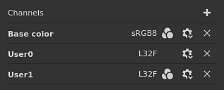
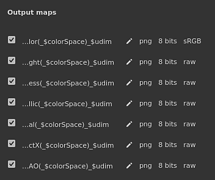
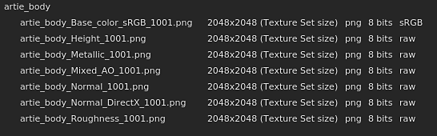
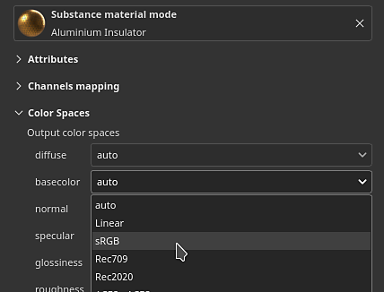
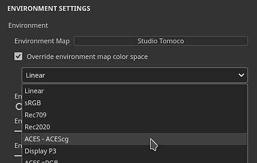

# Color management

Color management is the handling and conversion of colors. From importing resources to displaying colors on screen to finally exporting textures. Color calibration is important to ensure the same look across applications.

In the application color management is handled via the integration of [OpenColorIO](https://opencolorio.org/) (OCIO for short) version 2. OCIO is the standard in film and animation to convert and display colors. To enable color management, simply create a new project or open an existing one and enable the dedicated settings.

>[!NOTE]
>
> Color management is available since version 7.4.0.

## Project settings

Color management settings:

* [Color management with Adobe ACE - ICC](../../help/features/color-management/color-management-with-ado/color-management-with-adobe-ace-icc.md)
* [Color management with OpenColorIO](../../help/features/color-management/color-management-with-ope/color-management-with-opencolorio.md)

## Vocabulary

It may be helpful to know a few technical terms related to color management in order to understand better the associated workflow:

| Keyword | Description |
| --- | --- |
| **Color space** | Coordinate system in which colors are defined. |
| **Working space** | The color space used inside the application to blend texture, paint, etc. |
| **Display transform** | Display transform converts the linear colors from the working space to the color space of the monitor to display colors perceptually (to be seen by the human eyes). Display transforms often include a tonemapping pass to compress colors to fit the limited range of values allowed by a screen. |
| **Configuration** | A OCIO configuration file. It defines what is the working space, a list of color spaces and a list of display transform. |
| **ACES** | ACES stands for Academy Color Encoding System and is the standard in many application to exchange digital image files. Two version of this standard are included inside the application by default. |
| **Tonemapping** | It is the process of mapping color values from HDR (high dynamic range) to LDR (low dynamic range). This process helps display approximate the display of a wide range of colors. |

## List of color managed channels

Inside the application, which channels are color managed or not (data/passthrough) is pre-defined.

| Channel | Is color managed |
| --- | --- |
| **Ambient occlusion** | No |
| **Anistotropy angle** | No |
| **Anisotropy level** | No |
| **Base color** | **Yes** |
| **Blending mask** | No |
| **Coat color** | **Yes** |
| **Coat normal** | No |
| **Coat opacity** | No |
| **Coat roughness** | No |
| **Coat specular level** | No |
| **Diffuse** | **Yes** |
| **Displacement** | No |
| **Glossiness** | No |
| **Height** | No |
| **Ior** | No |
| **Metallic** | No |
| **Normal** | No |
| **Opacity** | No |
| **Reflection** | No |
| **Roughness** | No |
| **Scattering** | No |
| **Scattering color** | **Yes** |
| **Sheen color** | **Yes** |
| **Sheen opacity** | No |
| **Sheen roughness** | No |
| **Specular** | **Yes** |
| **Specular edge color** | **Yes** |
| **Specular level** | No |
| **Translucency** | No |
| **Transmissive** | **Yes** |
| **UserX (0-15)** | Depends on [Texture Set settings](../../help/interface/texture-set/texture-set-settings/texture-set-settings.md). By default user channels are not color managed. 

 |

## Color picker

When color management is enabled, the [color picker](../../help/interface/color-picker/color-picker.md) behavior change slightly:

* Colors are edited based on the current Display selected.
* A few additional information are added to the interface.

For more information, see the color picker [documentation page](../../help/interface/color-picker/color-picker.md).

## Viewport controls

Both the 2D and 3D views are color managed and have a dedicated settings available at the top of the viewport to control which display transform to use:

* **Left button**: Enable/disable the display transform of the viewport. If disabled the viewport will display colors as raw/passthrough. This button is enabled by default.
* **Right dropdown**: Specify which display transform to use to convert the colors to display them on screen. The default value is based on the OCIO configuration. This setting isn't saved with the project since it can be monitor dependent.

>[!NOTE]
>
> In solo mode (viewing channels individually) the color management is automatically disabled when viewing data channels (see the list above).

## Export settings

The main export settings are driven by the project configuration (see above).

Inside the [export textures](../../help/getting-started/export/export.md) window there is a keyword that can be used to append to the filenames the color space used per texture: **$colorSpace**.

<table>
<tr style="border: 0;">
<td style="border: 0;" valign="top">

{width="320px"}

</td>
<td style="border: 0;" valign="top">

{width="500px"}

</td>
</tr>
</table>

## Overriding color spaces

It may be necessary to specify an alternate color space for a resource to differ from the defaults. This can be done via the color space menu.

### Changing the color space of a resource

Inside the [properties window](../../help/interface/properties/properties.md) is it possible to override the color space of a specific resource (where it is currently used).

To do so, expand the color space section and use the dropdown to specify the new color space:

### Changing the color space of the environment map

Inside the [display settings](../../help/interface/display-settings/display-settings.md), enable the **Override environment map color space** then choose a color space in the list that matches your resource.

