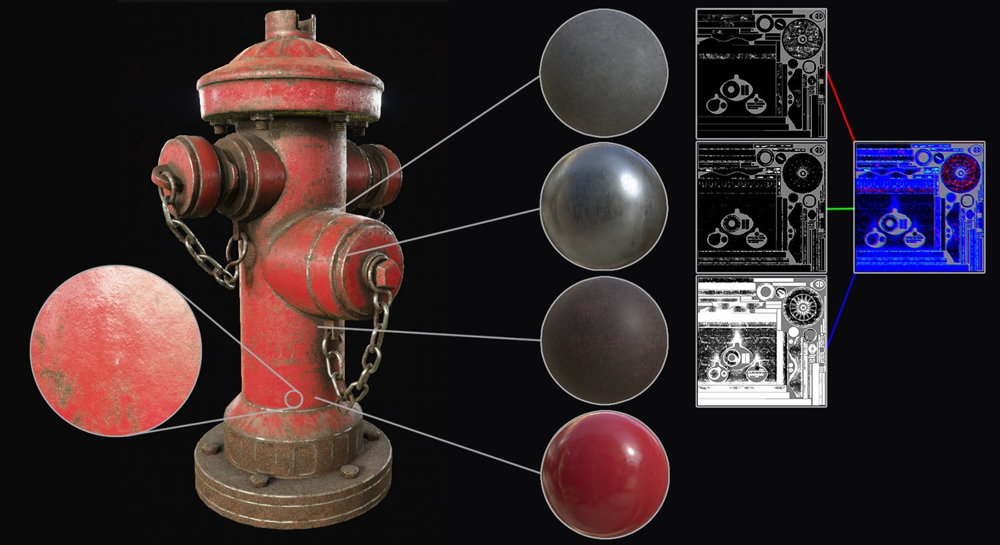
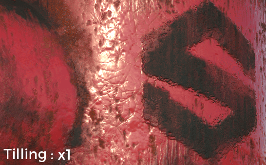
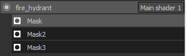
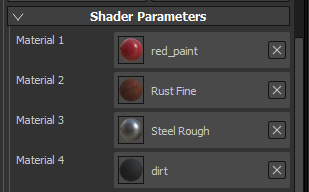
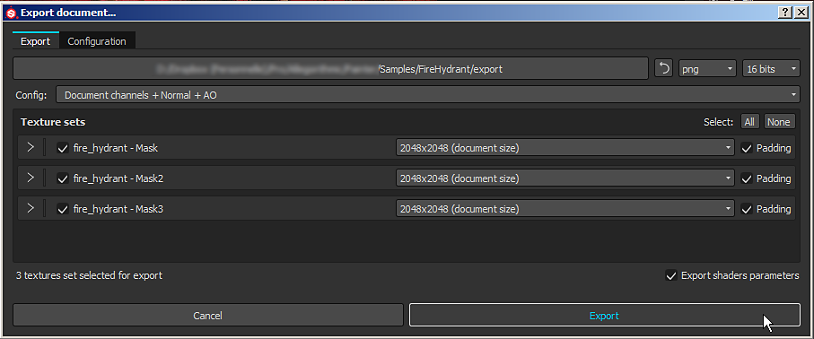
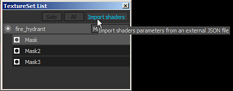

# Dynamic Material Layering

{width="450px"}

**Dynamic Material Layering**  is a specific workflow where generic materials are mixed together inside a shader instead of into a single texture. The main advantage of this workflow is that the blending is dynamic and allow to control and preserve a certain level of quality by tilling generic materials inside the shader. While materials are generic, the masks used to blend the materials are specific to mesh and therefore don't repeat.

{width="400px"}

To enable the material layering workflow, a specific shader is required.   
 The shader "  **pbr-material-layering**  " shipped by default with Substance 3D Painter allow to blend 4 materials with 3 masks.

## Sub-Layer stacks

In this shader sub-stacks can be defined and be sampled directly by the shader. Example with the shader "pbr-material-layering" shipped with Substance 3D Painter :

```

//: stacks [ 

//:   { 

//:     "id": "Mask", 

//:     "channels": [ 

//:   {"id": "opacity"} 

//:  ] 

//:   }, 

[...] 

//: ]
```


 In this example, the shader will create 3 sub-stacks on a given texture set with an "opacity" channel in each. Sub-stacks can be accessed in the TextureSet list window :

Because the  **channels**  of the sub-layer stacks are defined  **in the shader**  , it is impossible to add new channels in the texture set settings. To add or remove a channel an update of the shader file is required.

The number of channels supported maximum is defined by the number of samplers in total supported by the hardware.   
 While Substance 3D Painter supports bindless textures (and thus unlimited amount of textures) for materials loaded as parameters, the channels that are provided by the engine for the layer stacks are limited to 32 (under Windows). This limit also includes other textures such as the Normal and the Ambient Occlusion baked on the mesh of the project.

## Materials inputs

While it is possible to setup sub-stacks to define Materials in addition to Masks, it is often more practical to just define material inputs in the shader and use materials from the shelf directly. Most of the time these materials also exist in the final application such as Unity or the Unreal Engine 4. The naming convention to declare materials looks like the following in the shader "pbr-material-layering" :

```

//: materials [ 

//:   { 

//:      "id": "Material1", 

//:      "label": "Material 1", 

//:      "default": "", 

//:      "size": 1024, 

//:      "default_color": [0.5, 0.5, 0.5] 

//:   }, 

[...] 

//: ]
```


 Here is the result when some materials (substance materials or material presets) have been loaded :

The material resolution can be defined with the "size" parameter. It is also possible to load materials by default when the shader is created with the "default" parameter (by using the name/label of the ressource that need to be loaded).

To access the materials and mask in the shader itself, simply connect them with the "param auto" keyword :

```

//: param auto Material1.channel_basecolor 

uniform sampler2D color1; 

 

//: param auto Mask.channel_opacity 

uniform sampler2D mask;
```


In this specific workflow the most important part are the mask and the shader parameters. Therefor in the export window of Substance 3D Painter it is recommended to enable the "  **Export shaders parameters**  " setting. This will create a  **JSON**  file on the disk next to the textures that will contains information about the sub-stacks setup, the materials used and the shaders and their parameters. Parameters Export and Import

At the moment the packing of masks into a single texture is not supported during export. However a simple workaround to that would be to use the scripting features and call the Substance Batch Tools to do the packing with a Substance instead.



This JSON file can then be used to setup the layer stacks and shaders of a project.   
 This allow to do back and forth between multiple application easily by sharing common parameters.


