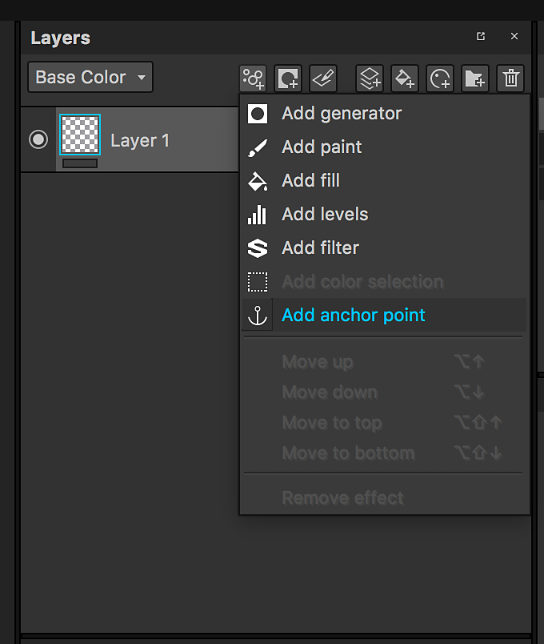
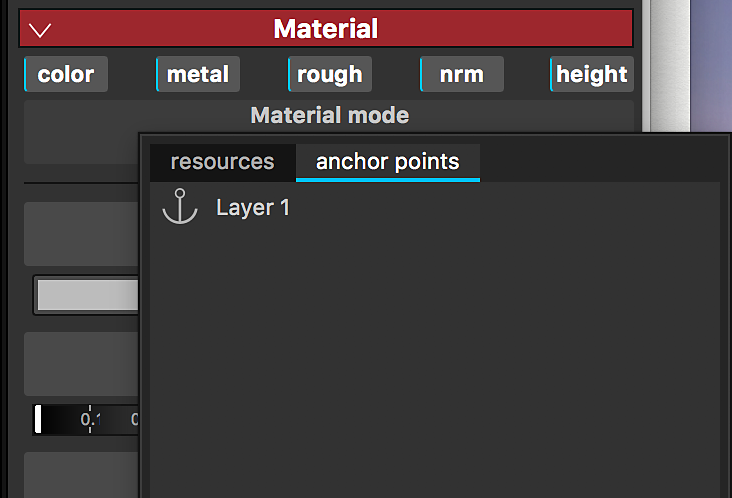
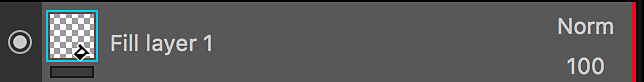
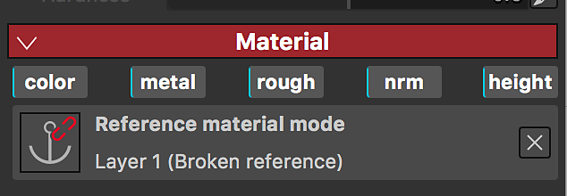
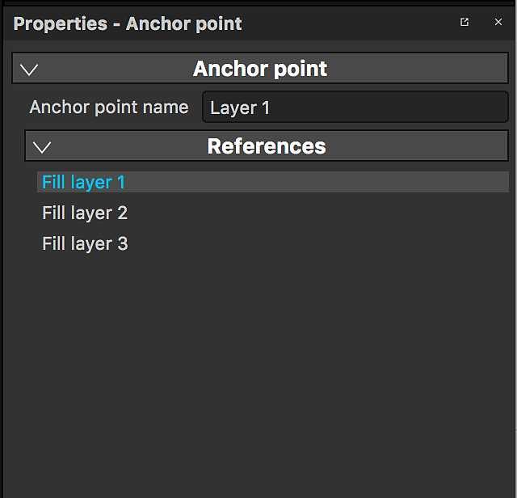
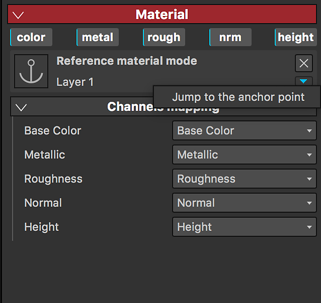

# Anchor Point

An Anchor Point is a way to expose any resource or element in the layer stack and reference it in different areas of the layer stack for different purposes and with a different set of adjustments. They open up a whole new set of possibilities, allowing you to effectively link layers or masks together and have a single Anchor point affect multiple aspects of your project, transforming Substance 3D Painter into a truly non-linear experience.

>[!NOTE]
>
> An anchor point can only be referenced inside the same texture is has been created. Creating links between an anchor and its reference(s) is not possible across Texture Sets.

## Add an Anchor Point

Anchor Point are available in the Effects menu. They can be added on both layers and masks.

## Use an Anchor Point as a Reference

An Anchor Point can be referenced by another layer: this will instantiate the content of the anchor point into the layer referencing it.

Anchor Points can be used as a reference in the following resources:

* Fill Layer
* Fill Effect
* Input of a substance filter (Effect, Procedural, Generator)

Only Anchor Points which are  **below**  the layer referencing it can be used as references.   
If you move an anchor point above a layer referencing it, it will break the reference. You can undo if you want to cancel this action.

## Find References for an Anchor Point

When you click on an anchor point you can see in the properties the list of layers where this anchor point is used as a reference.

## Find an Anchor Point

When you are a Fill layer / effect using an Anchor Point as a reference, you can jump to the anchor point.

