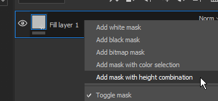

# Compare Mask

This effect allows to quickly and easily compare two channels and produce a mask as a result. This effect is only available for the Mask on Layers.

Below are the available settings for this effect :

| Setting | Description |
| --- | --- |
| **Channel** | The channel to compare between the source and the target to create a mask from. This lis is based on the channel available in the [Texture Set settings](../../../interface/texture-set/texture-set-settings/texture-set-settings.md). |
| **Compare** | Three parameters are available here to chose how the mask should be computed. The dropdown in the middle define the comparison operation (lesser than, within tolerance, greater than). 

 Source and Target mode are :<ul data-preserve-html="true"><li data-preserve-html="true"><strong>Layers Below</strong> : Take into account the flattened version of all the layers below the current one.</li><li data-preserve-html="true"><strong>This Layer</strong> : Take into account this layer only.</li><li data-preserve-html="true"><strong>This Mask</strong> : Take into account the existing content of the Mask (for example if a Fill effect or a Generator effect are already present).</li><li data-preserve-html="true"><strong>Constant</strong> : Uniform value.</li></ul>Operations are :<ul data-preserve-html="true"><li data-preserve-html="true"><strong>Lesser than</strong> : If the Source (left dropdown) has lower values than the Target (right dropdown) it will output white values in the mask.</li><li data-preserve-html="true"><strong>Within tolerance</strong> : If the Source (left dropdown) has similar values than the Target (right dropdown) it will output white values in the mask.</li><li data-preserve-html="true"><strong>Greater than</strong> : If the Source (left dropdown) has higher values than the Target (right dropdown) it will output white values in the mask.</li></ul> |
| **Constant** | Value to compare against when the compare setting is set to "constant". |
| **Hardness** | Controls the smoothness/hardness of the resulting mask comparison. |
| **Source Channels Histogram** | Provide an histogram view of the source and the target. Useful to know if they overlap a bit or not at all (if they don't overlap the mask will be empty).For more information about how histogram work, see : [Levels](https://helpx.adobe.com/substance-3d-designer/substance-compositing-graphs/nodes-reference-for-substance-compositing-graphs/atomic-nodes/levels.html). |

>[!NOTE]
>
> It is possible to right-click on a layer and choose the shortcut "**Add mask with height combination**" to quickly add this new effect on a layer. This shortcut will also switch the Height channel **blending mode** to "**Normal**" instead of the default "**Linear Dodge (Add)**".  
> 
