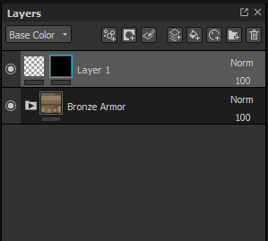
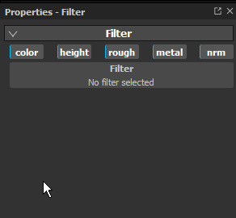
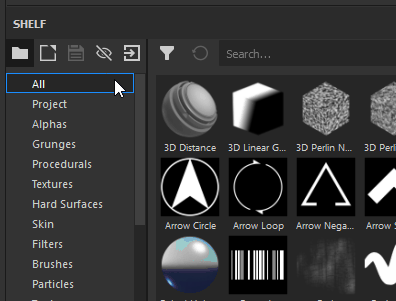
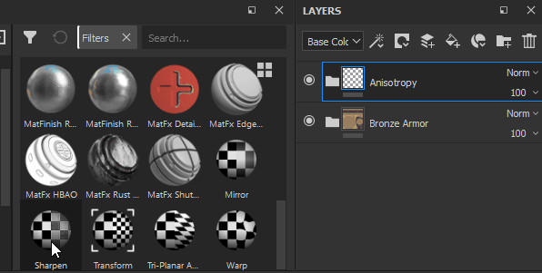

# Filter

Filter Effects are substances that transforms the content of a layer or mask.

## How to apply a filter ?

Depending of the filter type, a filter effect has to be created on the content or the mask of a layer.   
There are two ways to apply a filter, which one you use depends on how you intend your filter to work.

## Manually applying a Filter.

In the following example a blur filter is applied on the content of a layer, but it is more commonely used for applying Filters to Masks :

### 1 - Add a filter effect

Start by selecting the content of a layer (left thumbnail) then click on the effect button (or right click to open the context menu).   
Select the option "  **add filter**  " in the list.

### 2 - Select the filter in the properties window

In the properties window, the parameters or the filter are currently empty. Only the selection button is available.   
Click on the button to open the mini-shelf and select the desired filter, here we choose the blur filter.

## Drag-and-Drop a Filter from the Shelf

This method is only intended for filters that should apply to the whole Layerstack. It will automatically set all Channel [Blending modes](../../../interface/layer-stack/blending-modes/blending-modes.md) . It does not work for applying filters to a mask.

### 1 - Open the Filters area of the Shelf

In the Shelf, click the "Filters" section to the left.

## 2 - Drag-and-Drop the Filter

Select the filter you want to use in the shelf. Drag and Drop it into your layerstack, ensuring it is placed at the correct location (avoid dropping it into unwanted groups for example).

Note how in the above example the dropped filter already has a Passthrough Blending mode. This is true for all channels of the document.

## Adding new types of filters

All the filters are Substances, which can be created with Substance 3D Designer.   
As a quick startup, Substance 3D Designer provide templates ready to use for Substance 3D Painter.

For more information see this page : [Creating custom effects](../../../content/creating-custom-effects/creating-custom-effects.md)
