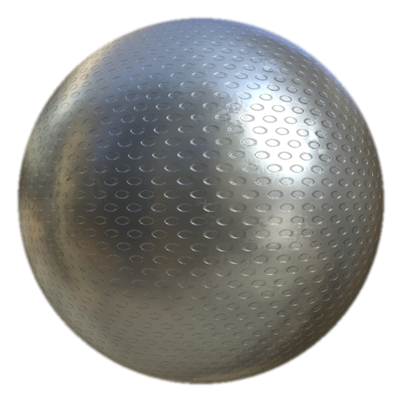

# MatFinish Perforated Circles

<table>
<tr style="border: 0;">
<td width="33.33%" style="border: 0;" valign="top">

<b>In:</b> Effects/finish, surface

</td>
<td width="100.00%" style="border: 0;" valign="top">

## Description

The MatFinish Perforated Circles filter is part of a metal finish collection and is used to create a metal effect with perforated circles.

It is used on a fill layer. Adjust the color, roughness, metallic, and other properties of the base fill layer, then add the filter for the final surface treatment.

</td>
</tr>
</table>

## Parameters

| Parameter name | Description |
| --- | --- |
| <b>Scale:</b> | Adjust the overall scale of the finish. |
| <b>Holes Size:</b> | Adjust the size of the holes. |
| <b>Details Intensity:</b> | Adjust the intensity of the surface details. |

