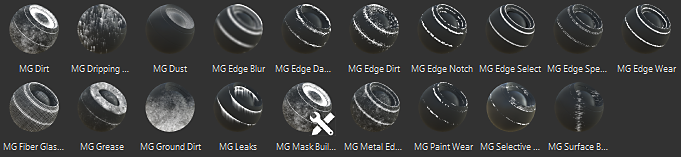

# Generator

Generators are substances that generate a mask or a material based on the mesh topology using the additional maps setup in the TextureSet Settings.

Each generator has a set of parameters allowing you to fine-tune the resulting mask.  
To add custom generators in the shelf, see :  [Adding content to the shelf](https://helpx.adobe.com/substance-3d/unlisted/documentation/spdoc/adding-content-to-the-shelf-142213317.html)

>[!NOTE]
>
> When creating a new substance in Substance Designer, you can choose the Painter Generator **template** to get a good starting point to build your generator upon.
