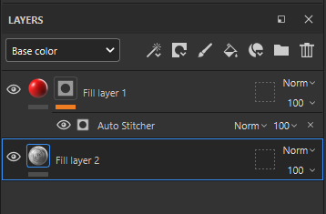

# Auto Stitcher

<table>
  <tr style="border: 0;">
    <td style="border: 0;" valign="top"> <strong>In:</strong> stitch, stitches</td>
    <td style="border: 0;" valign="top"><strong>Description</strong> The Auto Stitcher generator automatically creates a stitching effect along procedurally generated paths. These paths can be generated based on UV seams, Curvature, or a custom input map.  The Auto Stitcher generator outputs a monochrome (black and white) texture. As a result, it’s useful for generating masks to apply stitching effects.  To use the Curvature Mask Mode, a baked curvature map is required. <a href="../../../baking/baking.md">Learn more about baking here</a>.</td>
  </tr>
</table>

## Inputs

<table>
  <tr>
    <th>Input name</th>
    <th>Description</th>
  </tr>
  <tr>
    <td><strong>Curvature</strong> Grayscale</td>
    <td>Select how to generate the stitching paths: <ul><li><strong>UV Mask</strong> generates the paths along UV seams.</li><li><strong>Curvature </strong>generates paths near hard edges.</li><li><strong>Custom input</strong> allows you to control where paths are generated by using a map. When using <strong>Custom input</strong>, paths are generated in high-contrast areas.</li></ul></td>
  </tr>
  <tr>
    <td><strong>Custom Input</strong> Grayscale</td>
    <td>Use a custom texture or an anchor point.</td>
  </tr>
</table>

## Parameters

<table>
  <tr>
    <th>Parameter name</th>
    <th>Description</th>
  </tr>
  <tr>
    <td><strong>Mask Mode</strong></td>
    <td>Select the Mask mode. <ul><li>UV Mask: Masks based on UV islands.</li><li>Curvature: Masks based on the Curvature map.</li><li>Custom Input: Masks based on a Custom Input texture.</li></ul></td>
  </tr>
  <tr>
    <td><strong>Path Smoothness</strong></td>
    <td>Soften the path where the stitches are applied.</td>
  </tr>
  <tr>
    <td><strong>Path Position</strong></td>
    <td>Offset the path position.</td>
  </tr>
  <tr>
    <td><strong>Stitch Size</strong></td>
    <td>Adjust the scale of the stitches.</td>
  </tr>
  <tr>
    <td><strong>Stitch Width</strong></td>
    <td>Adjust the width of the stitches.</td>
  </tr>
  <tr>
    <td><strong>Stitch Length</strong></td>
    <td>Adjust the length of the stitches.</td>
  </tr>
  <tr>
    <td><strong>Stitch Roundness</strong></td>
    <td>Adjust the roundness of the stitches.</td>
  </tr>
  <tr>
    <td><strong>Jitter</strong></td>
    <td>Adjust the jitter in stitches flow direction.</td>
  </tr>
</table>

## Examples

<table>
  <tr>
    <td></td>
    <td>This example shows how custom input creates stitching paths.  <ul><li>The black and white base color shows the noise textures that we’re using as a custom input for the autostitcher generator.</li><li>The autostitcher generator is masking out the red layer, leaving the red stitched paths visible.</li><li>Notice that the red stitched paths fit into sufficiently large black or white regions of the custom input noise texture. The red stitching never crosses from white to black or black to white.</li></ul> The image below shows the simple layer setup used to create this example.  </td>
  </tr>
</table>
