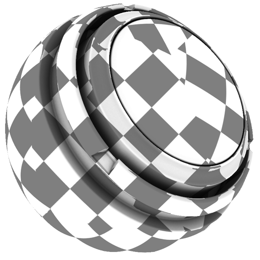

# Tri-Planar Advanced

<table>
  <tr style="border: 0;">
    <td style="border: 0;" valign="top"> <strong>In:</strong> mask, generator</td>
    <td style="border: 0;" valign="top"><strong>Description</strong> The Tri-Planar Advanced generator is a standalone version of the triplanar blending mode with manual controls for the full projection, including control over all rotation and offset values for each separate axis. Compared to the native fill projection, the Tri-Planar Advanced generator uses world-space normals to blend the three projection axes, while the native implementation only relies on low-poly geometry. This results in more control and more accurate results.  The Tri-Planar Advanced generator outputs a monochrome (black-and-white) texture. As a result, it’s useful for generating a tri-planar blending of either a custom mask or an anchor point to use as a mask.  Baked position and world space normal maps are required as image inputs. <a href="../../../baking/baking.md">Learn more about baking here</a>.</td>
  </tr>
</table>

## Inputs

| Input name | Description |
| --- | --- |
| **World Space Normal** Color | Use the baked World Space Normals map. |
| **Position** Color | Use the baked Position map. |
| **mask** Grayscale | Use a custom texture or an anchor point. |

## Parameters

<table>
  <tr>
    <th>Parameter name</th>
    <th>Description</th>
  </tr>
  <tr>
    <td><strong>Projection</strong></td>
    <td>Select whether to project all axes, or only a single axis.</td>
  </tr>
  <tr>
    <td><strong>Blending Mode</strong></td>
    <td>Select the Blending Mode to blend across axes. <ul><li><strong>Linear</strong>: In linear blending mode the blending transition line is straight.</li><li><strong>Advanced</strong>: In Advanced blending mode, axes are blended based on the maximum value between the 3 axes and the normal angle at the given location.</li></ul></td>
  </tr>
  <tr>
    <td><strong>Blending Contrast</strong></td>
    <td>Adjust how much the blending transition line gets blurred.</td>
  </tr>
  <tr>
    <td><strong>Texture Tiling</strong></td>
    <td>Adjust the tiling of the mask texture.</td>
  </tr>
</table>

### Axis X

| Parameter name | Description |
| --- | --- |
| **Rotation X** | Rotate the X Axis texture projection. |
| **Offset X X** | Move the X Axis texture projection left or right. |
| **Offset X Y** | Move the X Axis texture projection up or down. |

### Axis Y

| Parameter name | Description |
| --- | --- |
| **Rotation X** | Rotate the Y Axis texture projection. |
| **Offset Y X** | Move the Y Axis texture projection left or right. |
| **Offset Y Y** | Move the Y Axis texture projection up or down. |

### Axis Z

| Parameter name | Description |
| --- | --- |
| **Rotation X** | Rotate the Z Axis texture projection. |
| **Offset Z X** | Move the Z Axis texture projection left or right. |
| **Offset Z Y** | Move the Z Axis texture projection up or down. |
