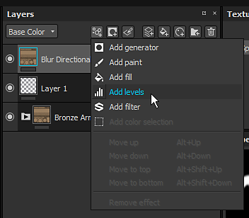
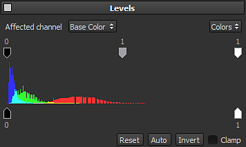

# Levels

The level is an effect used to adjust the color ranges of an image. It allows to balance and tone colors and/or graycales values. You can add it by opening the effect menu :

The main interface display a histogram (the mountain of colors in the middle of the interface) which is the representation of how pixels are distributed in an image at each color intensity level. The histogram shows details in the shadows (left part), midtones (middle part) and the highlights (right part). The histogram also give a quick look at the tonal range of the colors, allowing to determine how dark or bright the image is.

To adjust the color range of the image, two sets of controls are available at the top and the bottom of the histogram :

* The three top buttons control the shadows, midtones and highlights and can be used to redistribute the tonal range to contrast the overall image.
* The two bottom buttons control the black and white point of the image (usually 0 and 255). This can be useful to invert the colors of an image for example.

>[!NOTE]
>
> The levels effect can only be applied to one Channel at a time, as selected by the *Affected Channel* option. If you want to apply a level on multiple channels, you'll have to create multiple Levels effects.

* The Colors drop down box on the top right allows you to change the levels on the full rgb image or on only one of the red, green and blue channels.
* The Clamp option at the bottom right allows you to clamp the values of the levels between 0 and 1 (0-255). This option should always be checked when working on non HDR channels (like the **Base Color**).

[To further understand Levels, you should watch our course on Substance Academy dedicated to the topic.](https://academy.substance3d.com/courses/Mastering-Levels-Histogram)
