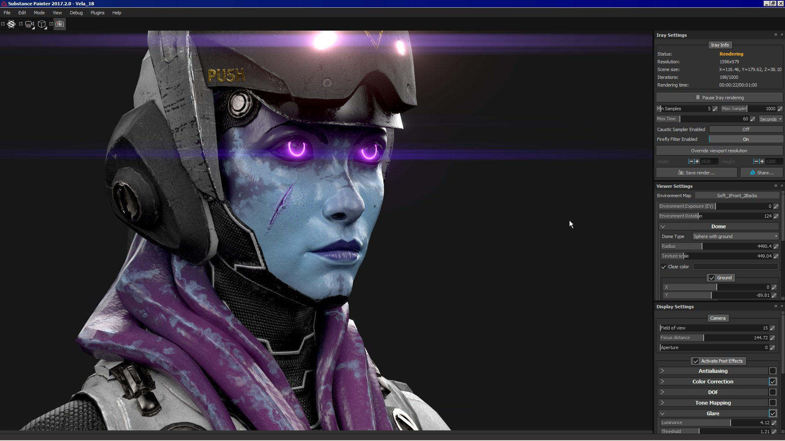
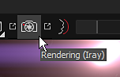
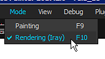

# Iray Renderer

{width="600px"}

**Iray**  is a GPU accelerated path-traced renderer developed by  [Nvidia](http://www.nvidia.com/object/nvidia-iray.html)  .   
With Iray it is possible to create image with a great accuracy of lighting in the scene and in high-definition (large resolution).

## Iray Mode

In order to start Iray, the mode of Substance 3D Painter has to be changed.   
This can be done by pressing in various ways :

* By pressing the  **F10 key**  (or  **F9**  to go back to to the Painting mode)
* By clicking on the Camera icon in the main toolbar
* By using the Mode menu

<table>
<tr style="border: 0;">
<td style="border: 0;" valign="top">

</td>
<td style="border: 0;" valign="top">

</td>
</tr>
</table>

## Iray Parameters

Iray use a specific set of parameters but also common properties shared by the regular viewport of Substance 3D Painter.

* [Iray Settings](../../features/iray-renderer/iray-settings/iray-settings.md)
* [Viewer and MDL Settings](../../features/iray-renderer/viewer-and-mdl-settings/viewer-and-mdl-settings.md)

## Display Settings

The Display settings let you control the camera and post effects settings.   
They are identical to the regular viewport rendering, therefor they allow to be in sync and avoid unwanted lighting differences.

For more details, see the dedicated page: [Display settings](../../interface/display-settings/display-settings.md)
