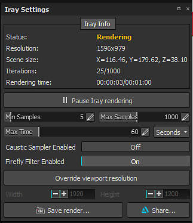
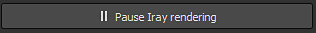

# Iray Settings

The Iray settings control the rendering of the IRay viewport, how long it will run and the quality of it.

## Iray Information

The top section of the window display the status of Iray alongside other information.

| *Setting* | *Description* |
| --- | --- |
| **Status** | The status indicate how Iray is working :<ul data-preserve-html="true"><li data-preserve-html="true"><strong>Rendering</strong> (Iray is computing the image)</li><li data-preserve-html="true"><strong>Paused</strong> (Iray computed stopped but has not finished)</li><li data-preserve-html="true"><strong>Done</strong> (Iray computation finished, or reached the settings values)</li></ul> |
| **Resolution** | The resolution of the Iray image (by default dependent of the viewport size). |
| **Scene Size** | The bounding box size of the scene/3D Mesh. There is no unit, but it is assumed to be in centimeters. |
| **Iterations** | The number of computation passes done by Iray over the maximum defined in the settings. |
| **Rendering time** | Time elapsed doing a render over the maximum time defined in the settings. |

>[!NOTE]
>
> The number of iterations will define the final quality of the render : more iterations = better quality.  
> However iterations can take some time, that why it is possible to define a maximum time. An iteration is defined by the number of samples.

## Settings

As soon as a setting has been modifier, Iray will start computing the rendering.  
It is possible to pause Iray to avoid this behavior with the dedicated button :

| *Setting* | *Description* |
| --- | --- |
| **Min Sample** | Minimum amount of samples performed by pixels |
| **Max Sample** | Maximum amount of samples performed by pixels |
| **Max Time** | The maximum amount of time allowed for Iray to do its computation.  The dropdown on the right allow to set the unit (seconds, minutes, or hours). |
| **Caustic Sampler Enabled** | This option allow to compute more advanced lighting reflections (caustics). |
| **Firefly Filter Enabled** | This option allow to get rid of isolated and very bright pixels that can happen sometimes. |
| **Override viewport resolution** | This setting allow to define a custom size for the rendering, instead of using the current viewport size. The **Width** and **Height** setting below allow to define it in amount of pixels. |
| **Save Render** | Action to export the current render (even if unfinished) to a file. |
| **Share** | Allow to share/export the current render to [ArtStation](https://www.artstation.com/). |
