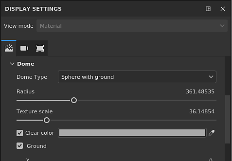
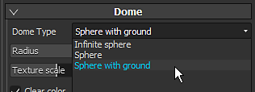
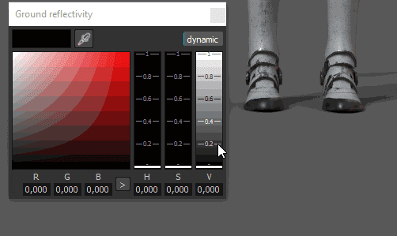
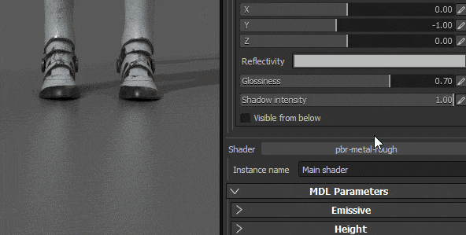
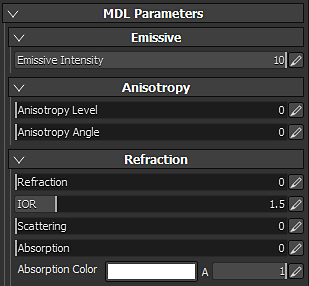
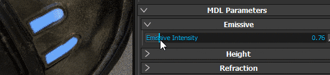

# Viewer and MDL Settings

{width="400px"}

## Environment

Identical to the regular viewport, the environment map used in Iray will control the lighting.   
 The environnement map can be changed by clicking on the button or by drag and dropping an HDR texture into it.

* **Environment Exposure**  : Control the exposition level of the HDR environment map.
* **Environment Rotation**  : to shift the environment texture and rotate the lighting around the scene.

>[!NOTE]
>
> Iray being a physically based renderer, the environment texture will greatly defines the lighting and the look of your scene.

## Dome

The dome is the shape on which will be projected the environnement map in the background.   
 3 types of dome are available, to use depending of the scene :

* **Infinite Sphere**  : The environnement is project in the background on a sphere to simulate the horizon, so always far from the scene
* **Sphere**  : The environnement is projected on a regular sphere, that can be scaled
* **Sphere with ground**  : Similar to the previous shape, this one also has a control to flatten the bottom of the sphere to simulate a floor.

>[!NOTE]
>
> The Sphere with ground has a control to define the size/radius of the floor, however a big radius will create distortions on the environment.   
>  Depending of the type chosen, the lighting can be affected.

Additional settings are available:

| *Setting* | *Description* |
| --- | --- |
| **Radius** | The size of the sphere (if not infinite) |
| **Texture Scale** | How much the texture will be stretched for the  **Sphere with ground**  type. |
| **Clear Color** | If enabled, replace the background image of the environment map with an uniform color. This will affect the lighting. |

### Ground settings

The ground settings allow to specify where a floor is located.   
 By default the value is set to fix the bottom of the bounding box of the scene.

| ***Setting*** | ***Description*** |
| --- | --- |
| **X, Y, Z value** | Define the location of the floor on the three axes.   The 0,0,0 value corresponds to the middle of the scene's bounding box. |
| **Reflectivity** | Defines the intensity and the color of the ground reflection.   A white brightness value means that the ground is 100% reflective while black means not reflective at all. 

 |
| **Glossiness** | Defines how glossy (or rough) is the reflection. 

 |
| **Shadow Intensity** | This parameter defines the final opacity of the shadow after the lighting has been computed. |
| **Visible from below** | Defines if the ground is visible from below or not. If checked, it means that the ground will occlude any element above it. |

## MDL and Shader parameters

Iray use MDL to define the materials used for the rendering of an object. For more information, see the  [official Nvidia page of the format](http://www.nvidia.com/object/material-definition-language.html)  .

By default in Substance 3D Painter, an MDL is associated with a GLSL shader, allow to switch between the regular viewport and Iray without having to configure anything.   
 The parameters of the MDL are then displayed in the bottom of the viewer settings. Below are the parameters of the default MDL (Compatible with the PBR Metallic/Roughness shader).

>[!NOTE]
>
> To load custom MDLs, a custom glsl shader is required.   
>  In the shader, some metadat can be added to specify the mdl path :
> 
> //- Declare the iray mdl material to use with this shader. //: metadata { //:   "mdl":"mdl::alg::materials::physically\_metallic\_roughness::physically\_metallic\_roughness" //: }
> 
> * **mdl**  : define the Iray mdl material to use with the shader. The path syntax is as follow:  *mdl::folder1::folder2::mdl\_filename::material\_name*  where  *folder1::folder2::mdl\_filename*  is the path inside one of your shelf  *mdl*  folder to a mdl file and  *::material\_name*  is the name of a material declared inside this mdl file. (ex: "mdl" : "mdl::alg::materials::physically\_metallic\_roughness::physically\_metallic\_roughness")

>[!NOTE]
>
> For each Material Instance in a project a MDL will be set. Therefor to separate the materials properties between Texture Set, set new Materials instance to configure spearately the MDLs.

The default MDL of Substance 3D Painter supports the following properties:

| *Setting* | *Description* |
| --- | --- |
| **Emissive Intensity** | Multiplier of the Emissive channel. A high value will start to emit light. 

 |
| **Refraction** | Controls the amount of Refraction. |
| **IOR** | Defines the index of refraction of the material.   Note : Air = 1.0, Water = 1.2, Glass = 1.5. |
| **Scattering** | Controls how much light is scattered through the surface. |
| **Absorption** | Controls how much light is absorbed through the surface. |
| **Absorption Color** | Simulates shifts in color when light passes through the surface. |
