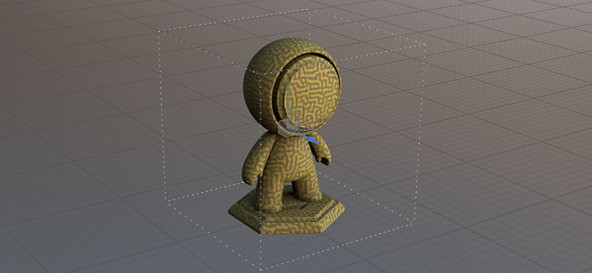

# Physical size

The physical size is a property inside Substance materials that defines their real size. It can be used to accurately match the size and look of materials over 3D surfaces. Painter uses centimeters as the default internal unit.

To use physical size, apply a material that has this property with a value other than 0,0,0 then enable the physical size mode in fill layer (or effect) under UV transformation &gt; Scale.

For more information, see:

* **Physical size** parameters in [Fill projections](../../painting/fill-projections/fill-projections.md)
* **Grid** parameters in [Viewport settings](../../interface/display-settings/viewport-settings/viewport-settings.md)

>[!NOTE]
>
> * From Painter version 8.3, physical size is available for all types of Projections.
> * Most mesh file formats specify the unit used during mesh creation, this unit will be converted to centimeters automatically during import.
> * Some formats, like .obj, do not have unit information, so when a project is created using an .obj mesh, it will be measured in centimeters by default without any conversions.
