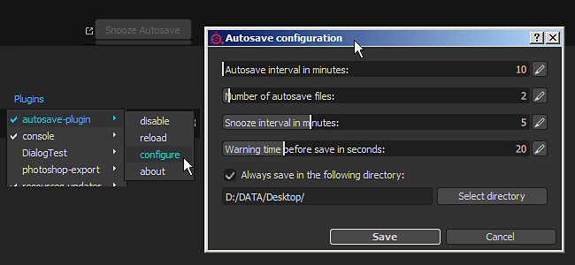

# Autosave

{width="500px"}

The autosave plugins allows to  **create backups**  of the currently opened project. It creates a file on the side while keeping the current project untouched.

The backup files will be located in three possible locations :

* If the current project has been saved the backups will be next to it.
* If the project has never been saved (untitled) the backups will be in the autosave folder in the user's Documents folder. (  **Documents/Allegorithmic/Substance 3D Painter/autosave**  )
* If the override setting has been enabled the backups will be located in the path given in the settings.

*A snooze button is available in the interface to delay the autosave.*

## How does the autosave trigger ?

The autosave is based on an internal timer, once the timer is over the autosave process begins.   
The snooze button will activate itself when near the end of the timer, allowing to delay the autosave for a few amount of time.

All the time based values can be modified via the settings window.

## How to disable the autosave ?

If for any reason disabling the autosave process is needed, it can be done via the plugin menu. To do so, click on  **Plugins**  &gt;  **Autosave**  &gt;  **Disable**  menu.

## Configure the Autosave

To configure the autosave behavior, click on  **Plugins**  &gt;  **Autosave**  &gt;  **Configure**  menu.

* **Autosave interval in minutes**  : indicate how much times to wait between each autosave.
* **Number of autosave files**  : the amount of backup files created maximum for a given project.
* **Snooze interval in minutes**  : how long the autosave will be delayed when clicking on the snooze button.
* **Warning time before save in seconds**  : how long before the snooze button is active and the progress bar is visible before the autosave trigger.

>[!NOTE]
>
> The autosave timer will pause if :
> 
> * The engine is doing a computation
> * Textures are being exported
> * The configuration window is open
> * The project is currently being saved

At the bottom of the window it is possible to override the default location of the backup files.   
When the setting "  **Always save in the following directory**  " is enabled, all the backup file will be located in the given folder (default path is the user's Documents folder).
