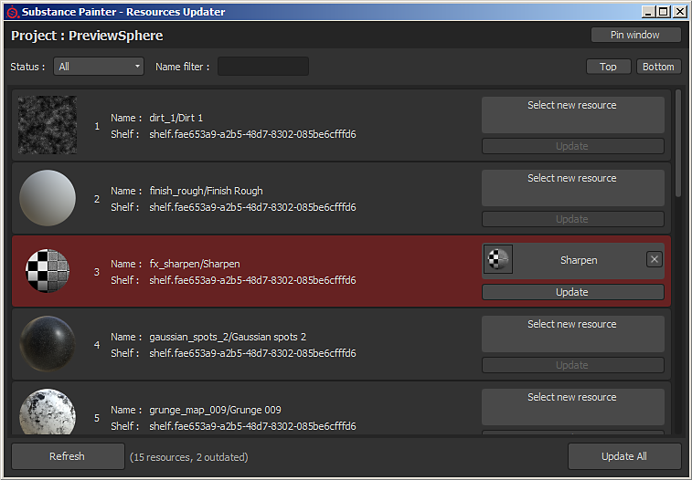

# Resources Updater

The **Resources Updater** plugin allow to browse resources present in the currently opened project.  
Each resource can be replaced by an other one present in the shelf. Resource showed in red are considerate as "outdated", it means a different version of the same resource is present in the shelf and is (probably) more recent.
