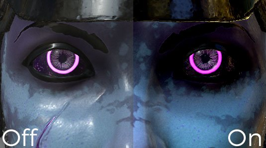
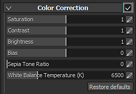

# Color correction

Color correction parameters :

| *Setting* | *Description* |
| --- | --- |
| **Saturation** | Controls the intensity/saturation of the color in the viewport. Use a saturation at 0 to get a grayscale render. |
| **Contrast** | Controls the difference between bright and dark colors. |
| **Brightness** | Controls the brightness/luminance of the colors. |
| **Bias** | Globally offsets the luminosity of the viewport. |
| **Sepia tone ratio** | Advanced parameter to give a sepia effect to the viewport. |
| **White Balance Temperature (K)** | Temperature of the colors, in Kelvins. Default is 6500K, corresponding to daylight. [See Wikipedia for more information](https://en.wikipedia.org/wiki/Color_temperature). |
