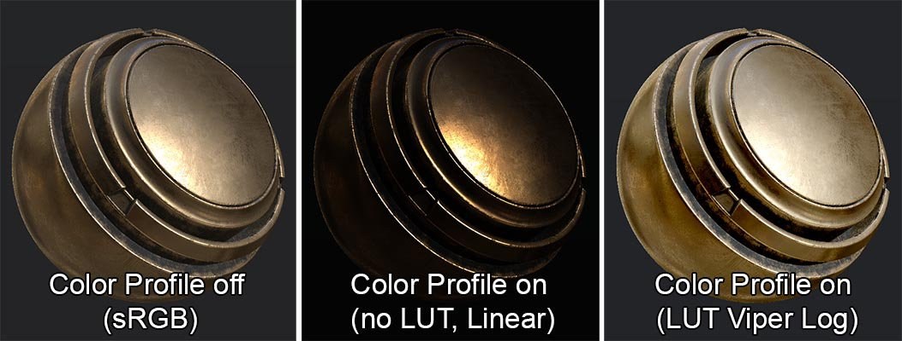
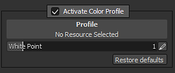

# Color Profile

{width="700px"}

Substance 3D Painter allows to assign  **Color Profiles**  to the  **viewports**  by loading  **LUT**  textures.   
 A color profile can be used to calibrate the final color of the screen to match a target, such as a specific camera. Often a profile will manipulate colors by changing the brightness, the gamma, the contrast or even the color balance.

>[!NOTE]
>
> **LUT** stands for "**Look Up Table**". It is an optimized way of performing color grading as a post effect. A LUT is used to make up the difference between a source and a result.   
>  Substance 3D Painter use  **3D**  LUTs stored as  **2D texture**  (Floating) of any possible resolution (default are  **2048x128 pixels**  ). This means the cube storing the color operations is separated in slices which are displayed side by side. For more technical details, see the  **GPU Gem**  article : <http://http.developer.nvidia.com/GPUGems2/gpugems2_chapter24.html>

## Using a Color Profile

A Color Profile can be loaded via the Display Settings window.   
 Check the "  **Activate Color Profile**  " checkbox to affect the viewport and enable a Color Profile.



* When "Activate Color Profile" is  **disabled**  the rendering of the viewport is done in  **sRGB**  for the Material view (and Linear for some specific channels)
* When "Activate Color Profile" is  **enabled**  the rendering of the viewport is done in  **Linear/Raw**  for every view (including solo channels)

If a LUT texture is loaded in the ressource slot, then it will be used to manipulate the rendering of the viewport when in  **Material mode**  .   
 Otherwise the rendering will be displayed as Linear/Raw (for example with solo channels views).

The  **white point**  setting can be used to change the tone mapping of the input image (before the LUT take effect).   
 If you are looking at the sun for example, the value should be higher than 1 (default). For a perfect exposure, the white point must be set to the high value of the image.

The white point formula is as follow:

```

float Value = 1.0f / WhitePoint; // Value from the user interface 

float3 Output = clamp( HDR.rgb * Value, 0.0f, 1.0f );
```


It is possible to apply a specific tone-mapping before using a the Color Profile. See the functions available in the [Tone Mapping](../tone-mapping/tone-mapping.md).  
 Substance 3D Painter doesn't process the input color other than via the white point setting. There are no Shaper LUT applied for example.

## Creating Color Profiles

Substance 3D Painter will shift the viewport to  **Linear**  rendering when the "  **Activate Color Profile**  " is enabled. This means that when a LUT is applied, it needs to translate color from a Linear profile to the desired target.

### Method 1 : Modifying the Identity LUT

Editing the identity LUT can be done in a software supporting <b>32bits floating</b> textures, such as <b>Substance 3D Designer</b>. Download the identity LUT as a starting point to make a new profile:

[Download color\_profile\_linear.exr](https://github.com/AdobeDocs/painter-python-api/raw/refs/heads/main/static/misc/color_profile_linear.exr)

### Method 2 : Using OpenColor IO to generate a LUT Texture

Install the  **OpenColor IO**  tools. Then download the Sample OCIO Configuration, available here : <http://opencolorio.org/downloads.html>   
 From there, run the  **ociolutimage**  program with the following arguments:

```

ociolutimage --generate --cubesize 64 --config nuke-default/config.ocio --colorconvert linear srgb --output lutLinearToSRGB.exr
```


**Note**: It is also possible to modify the Identity LUT with  **OpenColor IO**  by using the  **ocioconvert**  program to apply color conversion to this lut.

### Importing a new Color Profile

Simply open the import window (or drag and drop the LUT into the shelf). When importing the LUT texture in Substance 3D Painter, be sure to assign the "  **colorlut**  "  **usage**  to the new ressource. Otherwise the ressource won't be visible properly in the shelf.

For more information, see the documentation about the import of new ressources : [Adding resources via the import window](https://helpx.adobe.com/substance-3d/unlisted/documentation/spdoc/adding-content-via-the-import-window-151584824.html)
