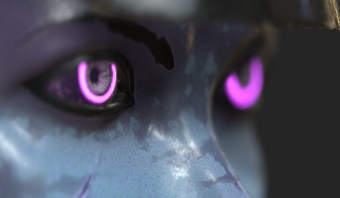
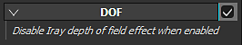

# Depth of Field

The **Depth of Field** (DOF) has no direct parameter. If enabled, it will **override** the DOF from **Iray**.

For controlling the look of the DOF in the viewport, two settings are available via the Camera :

| *Setting* | *Description* |
| --- | --- |
| **Focus Distance** | Defines the distance at which the focus point is located.  This point is used by the Depth of Field effect. 

 **Note:**  The Focus Distance can be set automatically by clicking on a point of the mesh with the shortcut **CTRL + Middle Mouse Button.** |
| **Aperture** | Defines how wide the Depth of Field will be. 

 **Note:**  If Iray is controlling this parameter, changing it will re-trigger a computation. |
