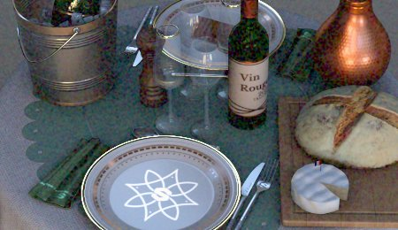

# Film grain

Adds a film grain noise pattern to the image, simulating the organic texture of analog photographic film.

| <b>Parameter</b> | <b>Description</b> |
| --- | --- |
|  |  |
| --- | --- |
| <b>Amount</b> | Controls the visibility and intensity of the grain. Higher values produce more prominent, noticeable noise. |
| <b>Radius</b> | Sets the size of individual grain particles in pixels. Smaller values create finer, more subtle grain; larger values produce coarser, more visible texture. |
| <b>Type</b> | Selects between monochromatic or colored noise. |

>[!NOTE]
>
> The noise generated by this effect is re-generated each time the viewport is refreshed. This is why when shadows are being generated or when rotating the camera the noise can update.
