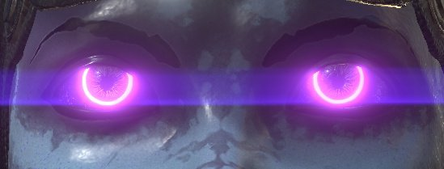
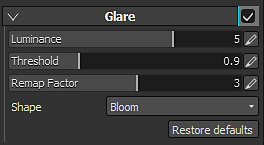
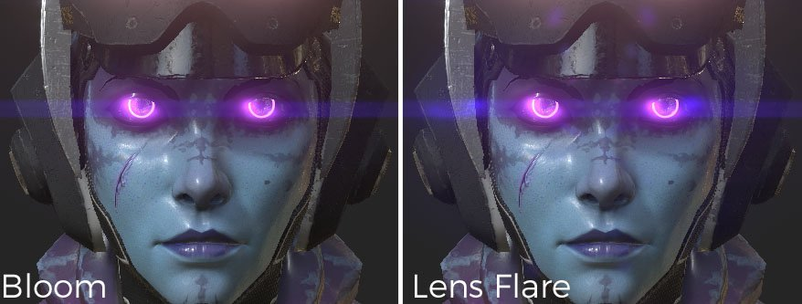
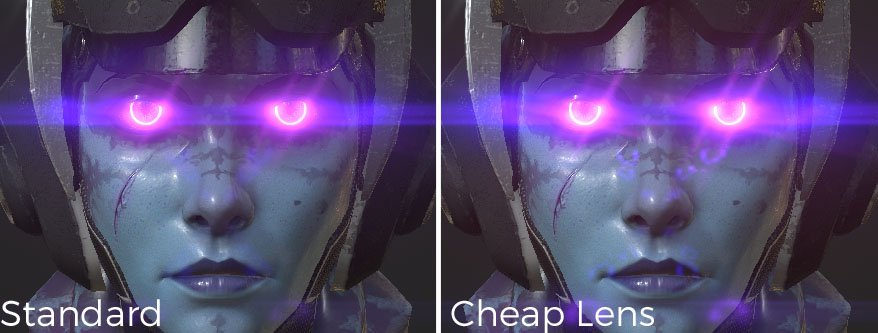
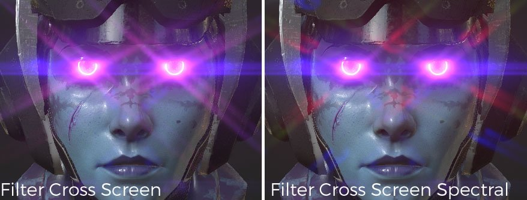
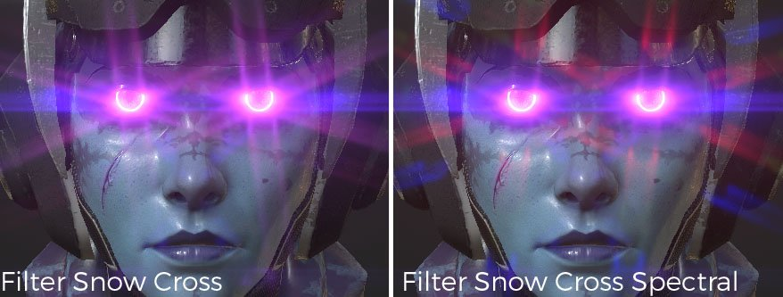
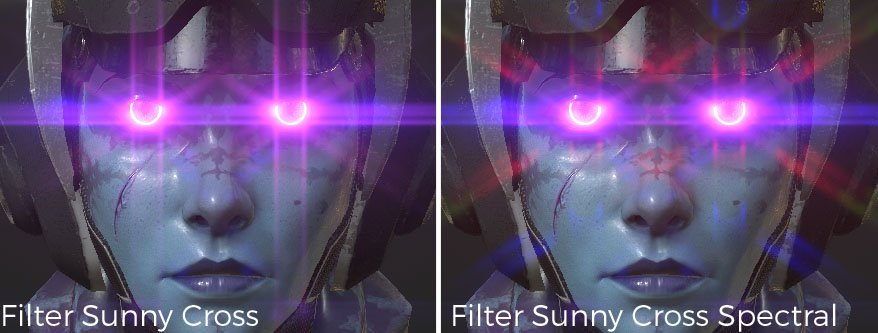
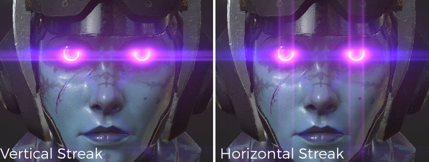

# Glare

Description of the parameters :

| Setting | Description |
| --- | --- |
| **Luminance** | This is the overall brightness of the glare effect. Setting this to 0.0 completely disables the effect.  Realistic values occur in the range of about 0.5 to 4.0, up to a maximum of about 16.0. |
| **Threshold** | Only pixels brighter than the threshold are extracted to generate glare.  For natural-looking results, values between 0.0 and 1.0 are recommended. |
| **Remap** **Factor** | Specifying a value other than 1.0 results in the extracted high-luminance component being further non-linearly expanded (or compressed). If you pass a value higher than 1.0, the glare becomes stronger for bright pixels.  Use this when to adjust the luminance mapping of the glare in isolation, without impacting other effects. The luminance after the bright pass increases in a smooth curve, with luminance values of 1.0 approaching **Remap Factor**, and those greater than 1.0 approaching (**Remap** **Factor** ^2). |
| **Shape** | The shape defines the look of the glare, different models are available :<ul data-preserve-html="true"><li data-preserve-html="true"><strong>Bloom</strong> : Only bloom effect.</li><li data-preserve-html="true"><strong>Lens Flare:</strong> Bloom / ghosts(lens flare) / afterimage.</li><li data-preserve-html="true"><strong>Standard:</strong> Type including a good balance of all the basic elements.</li><li data-preserve-html="true"><strong>Cheap Lens:</strong>  Sharp ghosting and other representations of a cheap lens. </li><li data-preserve-html="true"><strong>After Image:</strong>  Type with very strong afterimage. </li><li data-preserve-html="true"><strong>Filter Cross Screen:</strong>  Lens with generator of cross-shaped star filter attached.</li><li data-preserve-html="true"><strong>Filter Cross Screen Spectral</strong>: Lens with generator of cross-shaped star filter with strong spectrum attached.</li><li data-preserve-html="true"><strong>Filter Snow Cross</strong> : Lens with generator of star filter in six directions attached.</li><li data-preserve-html="true"><strong>Filter Snow Cross Spectral</strong> : Lens with generator of star filter with strong spectrum in six directions attached.</li><li data-preserve-html="true"><strong>Filter Sunny Cross</strong> : Lens with generator of star filter in eight directions attached.</li><li data-preserve-html="true"><strong>Filter Sunny Cross Spectral</strong> : Lens with generator of star filter with strong spectrum in eight directions attached.</li><li data-preserve-html="true"><strong>Horizontal Streak</strong> : This lens flare type produces strong horizontal star streaks.</li><li data-preserve-html="true"><strong>Vertical Streak</strong> : Type with strong star streaks in the vertical direction. Smears for CCD digital camera, etc.</li></ul> |

## Shape examples

