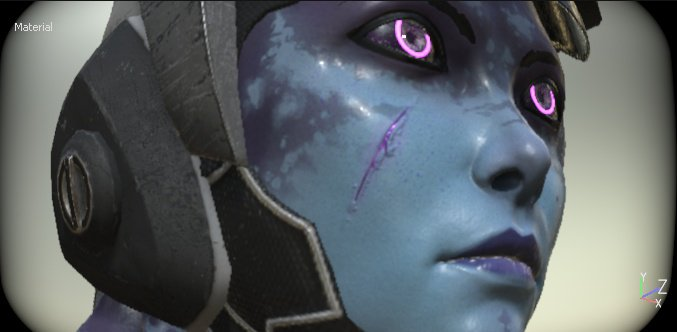
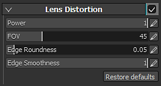

# Lens Distortion

Lens Distortion is an optical phenomenon resulting in a swelling or shrinking towards the perimeter of the image. The swelling is referred to as barrel distortion, and shrinkage is referred to as pincushion distortion.   
The better the camera lens, the less these phenomena will occur. This effect can be used to simulate imperfect lens and therefor more realistic images.

| *Setting* | *Description* |
| --- | --- |
| **Power** | Controls how fast the distortion is applied from the edges of the screen. |
| **FOV** | Controls the amount of lens distortion (simulated Field Of View). |
| **Edge Roundness** | Controls the round shape at the edges or the viewport. |
| **Edge Smoothness** | Controls the hardness/smoothness of the black edges of the viewport. |
