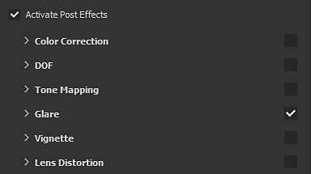

# Post Processing

Post-Effects are filters than can be applied to the images rendered in the viewport of Substance 3D Painter to simulate common camera effects.

The Post-Process effects of Substance 3D Painter are powered by the middleware  [Yebis](http://www.siliconstudio.co.jp/middleware/yebis/en/)  . Effects can be enabled individually, but the main post-process system has to be enabled first.

>[!NOTE]
>
> These post effects are not applied to the 2D view for convenience. Only the 3D view show the image result with the effects.

<table>
<tr style="border: 0;">
<td style="border: 0;" valign="top">

</td>
<td style="border: 0;" valign="top">

1. Step text
1. Step text
1. Step text
1. Step text
1. Step text

</td>
</tr>
</table>

The following pages describes the various post process effects supported by Substance 3D Painter:

* [Color correction](color-correction/color-correction.md)
* [Depth of Field](depth-of-field/depth-of-field.md)
* [Glare](glare/glare.md)
* [Lens Distortion](lens-distortion/lens-distortion.md)
* [Tone Mapping](tone-mapping/tone-mapping.md)
* [Vignette](vignette/vignette.md)
* [Color Profile](color-profile/color-profile.md)
