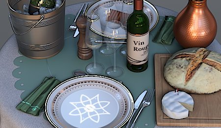

# Sharpen

Enhances the edges and fine details of the image to increase perceived sharpness.

| <b>Parameter</b> | <b>Description</b> |
| --- | --- |
|  |  |
| --- | --- |
| <b>Amount</b> | Controls the intensity of the sharpening effect. Higher values increase edge contrast more dramatically. |
| <b>Diameter</b> | Sets the size of the sharpening effect in pixels. Smaller values sharpen fine details; larger values affect broader edges and can create a more pronounced effect. |
