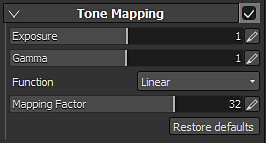

# Tone Mapping

The Tone Mapping parameters allow to control how the colors will be scaled to be displayed on the screen. Those settings can be useful to redistribute colors because of their wide range of values (which can exceed what the current screen is capable of displaying).

>[!NOTE]
>
> Substance 3D Painter outputs  **HDR**  (High Dynamic Range) colors (in Linear Gamma space), but most screens only allow to visualize  **LDR**  (Low Dynamic Range) colors. In order to map the HDR range to the LDR range, a conversion has to be done. This is the principle of the tone mapping.

| *Setting* | *Description* |
| --- | --- |
| **Exposure** | Scales the HDR space rendering results before any glare effects are applied or tone mapping takes place. |
| **Gamma** | This is the gamma value for gamma correction. |
| **Function** | Function to use to map the HDR range to the LDR range.  Available functions are:<ul data-preserve-html="true"><li data-preserve-html="true"><strong> Auto </strong> : The tone map function is selected automatically. Default is <strong> Sensitometric </strong>  . </li><li data-preserve-html="true"><strong> Linear </strong> : The output color is not clamped to 0 to 1 for this type only. This is optimal for when implementing some effect in the HDR space on the application side after the applying of the effects.  We do not recommend this unless you have some specific reason for using it, because the high luminance components will be completely lost and blown out highlights will occur if linear mapping is used as the final screen output as is.</li><li data-preserve-html="true"><strong> LinearSat </strong> : This is almost the same as <strong> Linear </strong> , except that the output color is clamped. Also, glare synthesis is a little smoother than <strong> Linear </strong> .</li><li data-preserve-html="true"><strong> Sensitometric </strong> : Default function when scene rendering is performed in the HDR space.</li><li data-preserve-html="true"><strong> Reinhard </strong> : This results in mapping that is more gradual than <strong> Sensitometric </strong> , and contrast that is slightly low. Accordingly, it causes the resolution of the high luminance components to become high, and stronger reproduction of the luminance variations in the bright portions.</li><li data-preserve-html="true"><strong> ReinhardLum </strong> : Type for implementing the <strong> Reinhard </strong>   tone map with the luminance as the reference and keeping the original saturation (vividness: RGB ratio). Maps only the luminance information to the LDR space and then reproduces the original saturation. The saturation in the HDR space is also kept after tone mapping.</li><li data-preserve-html="true"><strong> Log </strong> : This results in mapping that is even more gradual than <strong> Reinhard </strong> , and contrast that is low. It causes the resolution of the high luminance components to become high, and the strongest reproduction of the luminance variations in the bright portions.</li><li data-preserve-html="true"><strong> LogLum </strong> : Type for implementing the tone map of the logarithmic space with the luminance as the reference and keeping the original saturation (vividness: RGB ratio). This maps only the luminance information to the logarithmic space and then reproduces the original saturation. The saturation in the HDR space is also kept after tone mapping.</li></ul> |
| **Mapping Factor** | This controls the maximum level of the luminance (brightness) in HDR space that is mapped to the final LDR space in the tone mapping process. Colors brighter than the specified HDR space luminance cannot be represented in LDR space, resulting in blown out highlights. In concrete terms, this value is the luminance (after exposure scaling) in HDR space that maps to the maximum luminance value (1.0) in LDR space. In HDR rendering mode, the lower this value is, the higher the contrast and the greater the likelihood of blown out highlights. Conversely, specifying higher values results in lower contrast and decreases the likelihood of blown out highlights. In LDR rendering mode, when a remapping to HDR space takes place in order to apply an effect, the luminance range is expanded up to the value specified in  **Mapping Factor**  . Conversely, the  **Mapping Factor**  luminance is mapped to the maximum LDR luminance during tone mapping.In other words, this specifies the dynamic range scaling factor applied to the LDR rendering results for the application of effects. Setting this to a high value emphasizes bright regions in effects.  **Note:**  This setting will have no effect (it will be ignored) if the  **function**  is set to any of the following in HDR rendering mode:  **Linear**  ,  **LinearSat**  or  **Sensitometric**  . |
