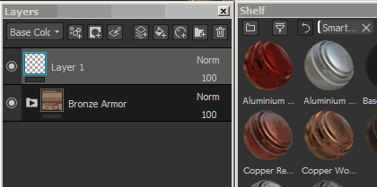
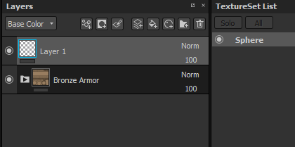
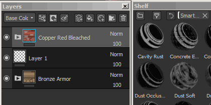
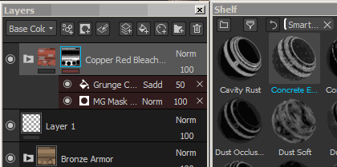
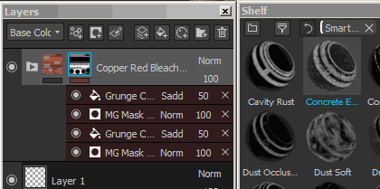
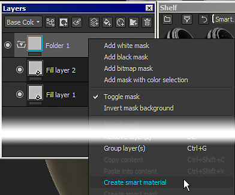
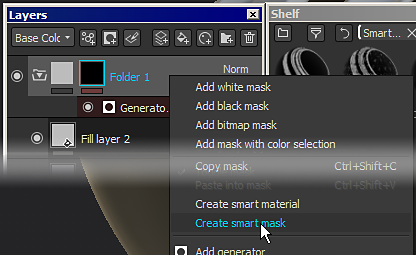

# Smart Materials and Masks

Substance 3D Painter supports the use of advanced  **layer presets**  . These presets can be used to quickly  **share across**  Texture Sets or Projects a  **similar texturing process**  while keeping the results different,  **adapted to the mesh topology**  .

>[!NOTE]
>
> Note that once added in the layer stack, there is no way to retrieve which smart material was used. In the case a smart material need to updated, the process will have to be done manually.   
> However individual resources can be updated with the [Resources Updater](../../help/features/plugins/resources-updater/resources-updater.md) .

## How to use Smart Materials/Masks ?

Smart Materials can be used anywhere in the layer stack, while smart masks can only be used in the effect stack.   
To know more about the differences, see : [Layer stack](../../help/interface/layer-stack/layer-stack.md) and [Effects](../../help/features/effects/effects.md)

### Adding a Smart Material

Smart Materials can be added in two different ways :

* By drag and dropping a smart materials from the shelf into the layer stack :   
   
* By clicking on the Smart Material button to open a mini-shelf :   
   

### Adding a Smart Mask

Because Smart Masks are presets of effects, they can therefor only be added to effect stacks (for mask specifically).

* To add a Smart Masks, simply  **drag and drop**  one from the Shelf onto the  **target**  layer :   
   
* Drag and dropping  **multiple**  Smart Masks will accumulate them :   
   
* It is possible however to  **replace**  the whole effect stack by pressing  **CTRL**  during the drag and drop :   
   

### How to create Smart Materials/Masks ?

To create a Smart Materials, a  **folder**  is required.   
The content of the Smart Materials will be contained in the folder. Then simply right-click on the folder and select "  **Create smart material**  ". The Smart Material will then be added to the current shelf and will be named accoridng to the folder selected.

To create a Smart Mask, simply right-click over a layer and choose "  **Create smart mask**  ".

## How to share/retrieve a smart material/mask ?

The presets are saved  **on the disk**  and can be retrieved from their dedicated folder.   
To find the  **shelf location**  , see : [Adding content on the hard drive](../../help/content/importing-assets/adding-content-the-hard/adding-content-on-the-hard-drive.md) .

Then anybody can simply  **import**  the file into their Substance 3D Painter shelf to use the preset.
