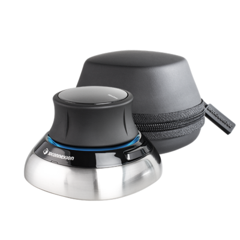
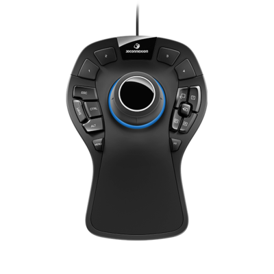
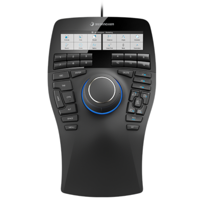
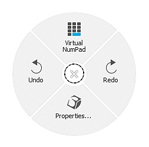
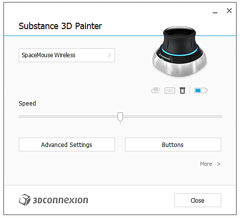
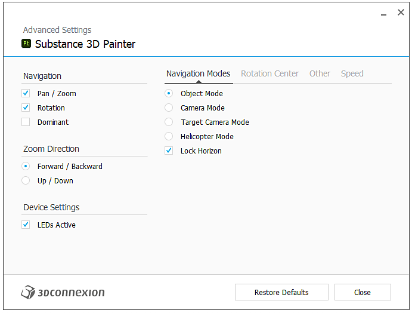
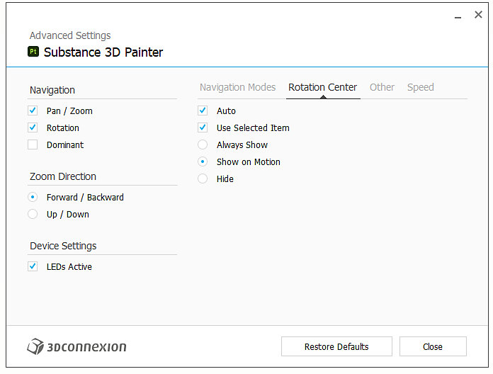

# SpaceMouse® by 3Dconnexion

The SpaceMouse® by 3Dconnexion is a device that allows to easily navigate in 3D. It can be used to manipulate the camera/3d model in the application viewport.

* The SpaceMouse® is supported since version 7.4.2.
* To use correctly this device, make sure to install the latest driver from [3Dconnexion](https://3dconnexion.com/uk/drivers/).

>[!NOTE]
>
> Users who use the compact model and need to frequently rotate the environment map might choose to assign the SHIFT key to the left button.

## Tutorial

## Overview

The main control knob or the SpaceMouse® lets you rotate, pan and zoom in the viewport in ways that are not possible with regular mouse/stylus and keyboard controls. The device can used in combination with mouse and tablets with stylus.

All models and versions should be compatible with the application:

| Model | Description | Visual |
| --- | --- | --- |
| **Compact Model** | Base model with the Knob control. | 

 |
| **Pro Model** | Knob control and additional buttons for keyboard shortcut. | 

 |
| **Enterprise Model** | Knob control, additional buttons and contextual display. | 

 |

>[!NOTE]
>
> The Compact, Pro and Enterprise models have been tested and validated to properly work with the application.

## Radial menu

The menu can be accessed directly from the device:

* On the Compact model by clicking on the left button and choosing properties from the radial menu:

  {width="250px"}
* On the Pro and Enterprise models, the properties menu can be accessed by pressing the Menu button.

Alternatively, right click on the 3Dconnexion icon in the system tray (next to the system clock) and choose **Open 3Dconnexion Settings**. This menu is context sensitive based on the last active window. Its title bar indicates to which program it corresponds, if it is not Adobe Substance 3D Painter, switch to the Painter window and then go back to the settings window:

## Default settings

{width="400px"}

In the settings panel of the SpaceMouse®, default settings for Painter are available in the latest version of the drivers. No additional configuration is needed, simply connect the device and it will be plug and play.

Make sure to select the correct device from the top drop down menu, by default it should select the correct one.

The "speed" slider changes the sensitivity in all axes and directions.

### Advanced settings

By clicking on "Advanced Settings" button, it lets you change the detailed behavior of the main controls.

Any default setting can be modified. There are two important sections with the tabs **Navigation Modes** and **Rotation Center**.

#### Navigation modes

{width="400px"}

Define the behavior how behaves the knob in 3D:

| Setting | Description |
| --- | --- |
| Object Mode | The knob is the 3D object itself, it is the default. |
| Camera Mode | Control the camera freely in 3D. |
| Target Camera Mode | Control thecamera always targeting a point in the 3D space. |
| Helicopter Mode | Control an helicopter in the 3D space. |
| Lock Horizon | To lock the camera so the horizon is always horizontal. Painter already gives a similar option in its settings but it can be separately controlled here. It is locked by default. |

#### Rotation center

{width="400px"}

Define the small pivot icon behavior:

| Setting | Description |
| --- | --- |
| Auto | Move the pivot or camera target automatically, if off, it always stick to the mesh origin pivot. |
| Always Show | The pivot point is always displayed in the 3D viewport even when not interacting with the device. |
| Show on Motion | The pivot point is displayed in the 3D viewport only when interacting with the device. This is the default option. |
| Hide | Completely remove the pivot point in the 3D viewport. |

>[!NOTE]
>
> The pivot point has been designed specifically for Painter but it can be hidden if needed.

### Buttons

{width="400px"}

By clicking on **Buttons**, it is possible to assign commands, macros or radial menus. See the [3Dconnexion documentation](https://3dconnexion.com/uk/support/faq/) for more details.
