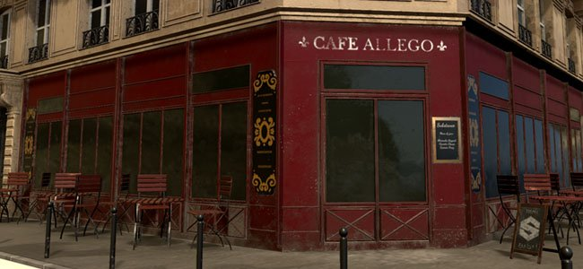
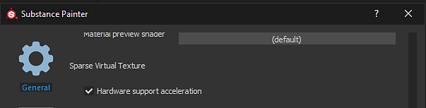
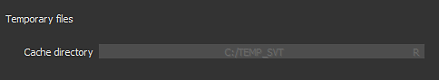

# Sparse Virtual Textures

Starting with version  **2018.3**  Substance 3D Painter use  **Sparse Virtual Textures**  (  **SVT**  ) in its realtime viewport to manage large amount of textures. This technology allows to stream in and out textures that are only necessary from a given point of view in order to maintain a specific footprint on the GPU memory. It improves performances on projects with a large amount of Texture Sets (or UDIMs).

## Supported Platforms

Sparse textures rely on a specific hardware configuration in order to be fully performant. If the current configuration doesn't support it properly, Substance 3D Painter will  **fallback**  to a software implementation instead (which will be less precise and less performant).

It is possible to force Substance 3D Painter to use the software fallback instead of the Hardware acceleration by going in the [Settings](../../interface/settings/settings.md) .

Here are the configuration that support the hardware accelerated Sparse Virtual Textures :

| Platform | Supported (Hardware accelerated) | Unsupported (Software fallback) |
| --- | --- | --- |
| **Windows** | <ul data-preserve-html="true"><li data-preserve-html="true">Nvidia GeForce (Drivers 411.63 or higher)</li><li data-preserve-html="true">Nvidia Quadro (Drivers 411.63 or higher)</li><li data-preserve-html="true">AMD FirePro &amp; Radeon Pro (Drivers 18.9.3 or higher) <strong> &#42; </strong></li><li data-preserve-html="true">AMD Radeon (Drivers 18.9.3 or higher)&#42;</li></ul> | <ul data-preserve-html="true"><li data-preserve-html="true"> Nvidia Quadro M2000 </li><li data-preserve-html="true">  Nvidia  Geforce GTX 970 </li><li data-preserve-html="true"> Intel GPUs </li></ul> |
| **Mac OS** | <ul data-preserve-html="true"><li data-preserve-html="true"> Hardware feature unsupported by the operating system </li></ul> | <ul data-preserve-html="true"><li data-preserve-html="true">Any GPU model</li></ul> |
| **Linux** | <ul data-preserve-html="true"><li data-preserve-html="true">Nvidia GeForce (Drivers 410.73 or higher)</li><li data-preserve-html="true">Nvidia Quadro (Drivers 410.73 or higher)</li><li data-preserve-html="true">AMD FirePro &amp; Radeon Pro (Drivers 18.9.3 or higher) <strong> &#42; </strong></li><li data-preserve-html="true">AMD Radeon (Drivers 18.9.3 or higher)&#42;</li></ul> | <ul data-preserve-html="true"><li data-preserve-html="true">Intel GPU</li></ul> |

* **\*** : Hardware acceleration disabled by default, can be enabled manually in the [Settings](../../interface/settings/settings.md) .

## Why is Substance 3D Painter using Sparse Virtual Textures ?

Substance 3D Painter use its main engine for computing textures which are then displayed in the viewports. This means the engine and the viewport have to share the GPU memory (VRam) for computing and displaying these textures. The more  **Texture Sets**  (or UV Tiles) a project contains, the more memory will be needed for the viewport. If the viewport takes too much memory on the GPU, the main engine don't have enough room to compute textures and will have to evict textures into the system memory (Ram). This will result in poor performances and slow computations.

The goal of the SVT is to budget how much the viewport can use on the GPU memory, letting as much room as possible for the main engine to do computations. The advantage of the system is that it also unlock the ability to load much bigger project into Substance 3D Painter while still being able to work as normal.

## How does Sparse Textures work ?

Sparse Virtual Textures are a type of textures which are not complete. This means the application only load parts of textures in memory. Only what is needed is loaded and the rest is put into the system memory or on the disk (cache). When needed again, the textures are retrieved from the cache and put back into the viewport. To make transferts quick enough the system relies on  **mipmaps**  and jump between different resolution of texture rapidly. This is why moving quickly into the viewport may display blurry textures at first which then increase in quality after a few seconds.

For more technical knowledge, see :  [Sparse Virtual Textures](https://silverspaceship.com/src/svt/)  .

## Cache Location

When there isn't enough system memory (Ram) available to store the SVT cache Substance 3D Painter will switch to the computer hard drive instead to store the cache.   
The location of this cache is by default into the Operating System Temporary Files folder. This location can be changed by going into the main settings of the application, see the [General preferences](https://helpx.adobe.com/substance-3d/unlisted/documentation/spdoc/general-71008262.html) .

## Shader compatibility

In order to take full advantage of the SVT, Shaders have to request and read textures from the the Sparse system. Therefor previous functions based on  **vec2 texture coordinates**  and  **samplers**  have been deprecated. Helper functions are now provided instead to use the Sparse textures.

To update your Shaders :

* For  **Default Substance 3D Painter shader**  : Follow the step by step procedure from the [Updating a shader](../../interface/shader-settings/updating-a-shader/updating-a-shader.md) page.
* For  **Custom shader**  : take a look at the error message(s) in the log as well as the [Shader API](https://helpx.adobe.com/substance-3d/unlisted/documentation/spdoc/custom-shader-api-89686018.html) page.

>[!WARNING]
>
> Older projects may display white flashes if their shaders are not up to date. See this page for more information : [Mesh flash to white when moving camera](../../technical-support/technical-issues/rendering-issues/mesh-flash-white-when-mov/mesh-flash-to-white-when-moving-camera.md).
