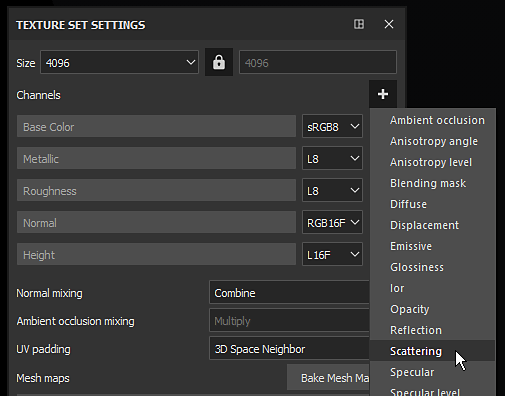
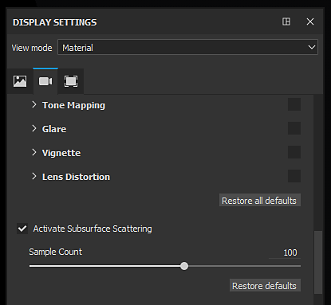
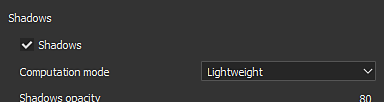

# Enabling Subsurface in a Project

To activate properly the Subsurface scattering in Substance 3D Painter a few parameters have to be set first.   
This page provide a guide on which parameters to enable.

## 1 - Texture Set Settings

In the [Texture Set](../../../interface/texture-set/texture-set.md) add a  **Scattering**  channel if not already present :

>[!NOTE]
>
> The Scattering channel works like a  **mask**  over the  **surbsurface**: if the channel is black there is no subsurface at all, while if it is white the subsurface intensity will be at maximum. This channel is a grayscale value that is  **black by default**  . Add a fill layer in the layer stack to control the default color or use a paint layer to manually control the intensity.

## 2 - Global Subsurface Setting

Enable the main Subsurface scattering setting in the [Display settings](../../../interface/display-settings/display-settings.md) (below the Post-Effects settings) :

>[!NOTE]
>
> Enabling/disabling the Subsurface effect affects the whole project. It can be helpful to use this global parameter if it is too heavy in terms of performance.

## 3 - Shader Settings

In the [Shader settings](../../../interface/shader-settings/shader-settings.md) window with default shaders can be found a "  **SSS Parameters**  " group with two settings.   
Change the scale and the color to fit the target material. For more details on these settings see: [Subsurface Parameters](../subsurface-parameters/subsurface-parameters.md)

## Bonus : Enabling shadows

The Subsurface scattering effect works well but may look strange if alone.   
Enabling shadow can help the final look in the viewport and improve the realism of the final material.

In the [Environment settings](../../../interface/display-settings/environment-settings/environment-settings.md) window, enable the "  **Shadows**  " setting:

