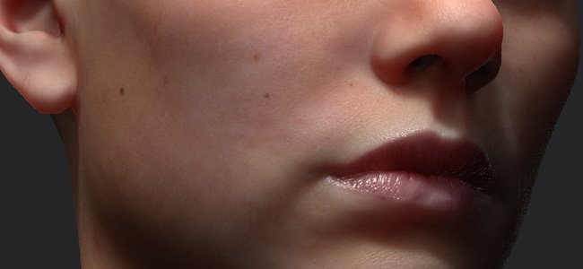
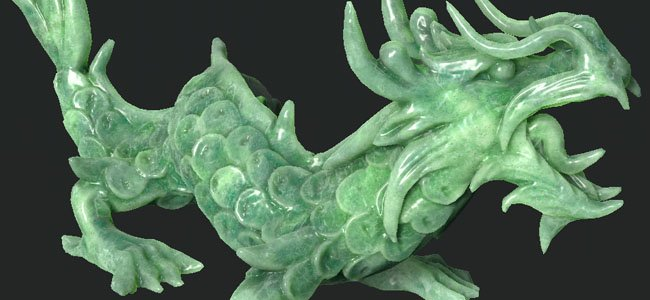
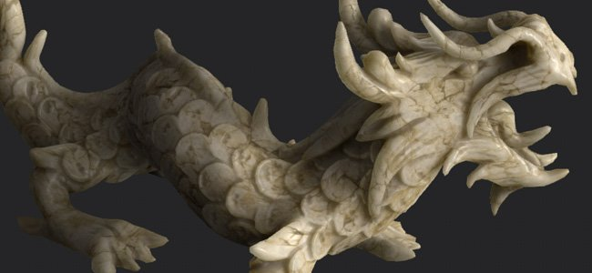
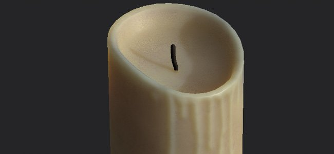
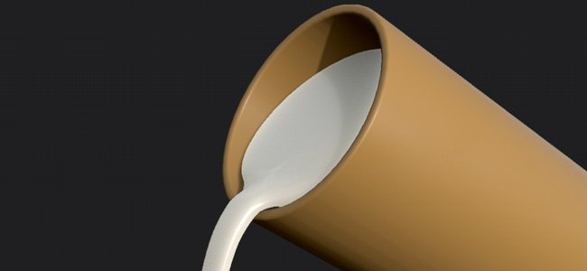

# Subsurface Material Type

This page list the various type of materials that can be created with the Subsurface scattering feature and how to configure Substance 3D Painter to create them. For each type of material is given a scale and color which can be set in the [Subsurface Parameters](../subsurface-parameters/subsurface-parameters.md).

>[!NOTE]
>
> The values listed on this page are here to give an overview of each type of material. They are not exact values and have to be interpreted and/or adjusted per project.

## Human skin

For a good skin material it requires:

* A good base texture : for a realistic character this means a good amount of details and various colors.
* A strong height/normal texture : the subsurface effect will soften the surface details, having strong details in the first place will compensate.

| *Setting* | *Description* |
| --- | --- |
| **Scale** | <ol data-preserve-html="true"><li data-preserve-html="true">05 to 0.2</li></ol> |
| **Color** | **R**  : 0.575   **G**  : 0.894   **B**  : 0.376 

 **Note:**  This color is suited for Caucasian skin type. |

Examples of realistic humans can be found via 3D scans of real people:

* Digital Emily : <http://gl.ict.usc.edu/Research/DigitalEmily2/>
* Infinite Realities LPS Head : <http://www.ir-ltd.net/> | <http://casual-effects.com/data/>

## Jade

**Jade**  is an ornamental mineral, mostly known for its green varieties, which is featured prominently in ancient Asian art.

| *Setting* | *Description* |
| --- | --- |
| **Scale** | <ol data-preserve-html="true"><li data-preserve-html="true">25</li></ol> |
| **Color** | **R**  : 0.575   **G**  : 0.894   **B**  : 0.376 

 |

## Marble

| *Setting* | *Description* |
| --- | --- |
| **Scale** | <ol data-preserve-html="true"><li data-preserve-html="true">25</li></ol> |
| **Color** | **R**  : 0.845   **G**  : 0.777   **B**  : 0.525 

 |

## Wax

Wax regroups a wide range or organic compounds. It exists naturally but can also be made in laboratory. Wax can be found in candles for example.

| *Setting* | *Description* |
| --- | --- |
| **Scale** | <ol data-preserve-html="true"><li data-preserve-html="true">6 or more.</li></ol> |
| **Color** | **R**  : 0.820   **G**  : 0.470   **B**  : 0.205 

 |

## Milk

| *Setting* | *Description* |
| --- | --- |
| **Scale** | <ol data-preserve-html="true"><li data-preserve-html="true">7</li></ol> |
| **Color** | **R**  : 0.895   **G**  : 0.833   **B**  : 0.750 

 |
