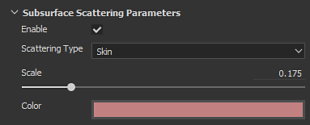
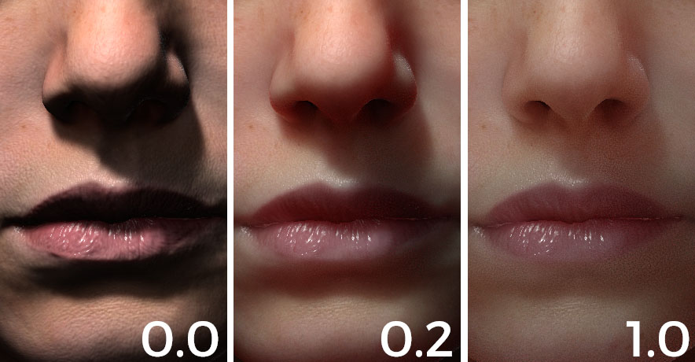
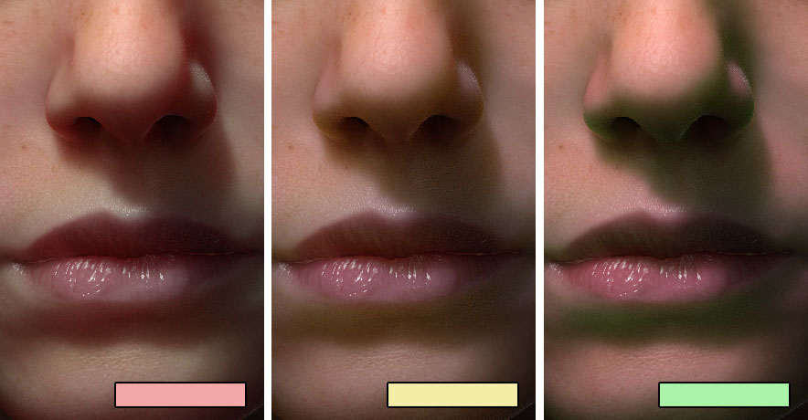
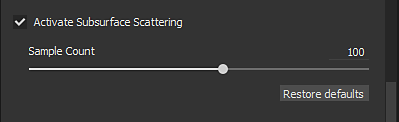
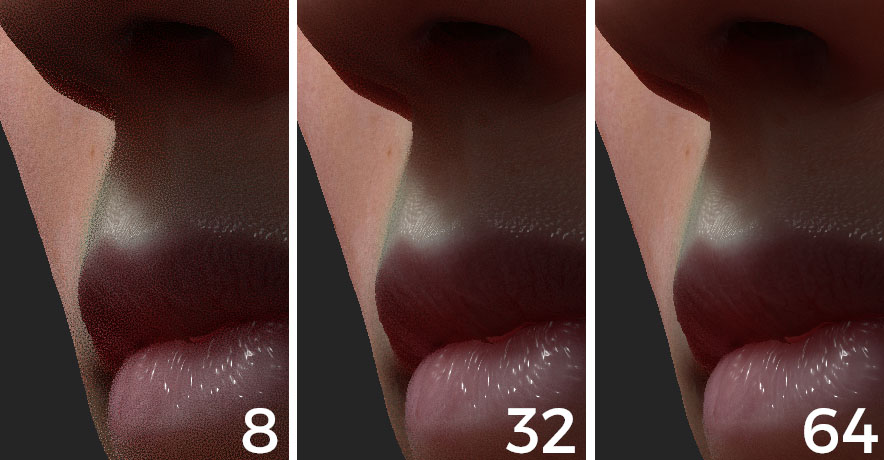

# Subsurface Parameters

Substance 3D Painter real-time subsurface implementation is a screen-space subsurface scattering effect. The parameters to control it are explained in this page.   
The current implementation is based on the "Approximate Reflectance Profiles for Efficient Subsurface Scattering" method  [published by PIXAR](http://graphics.pixar.com/library/ApproxBSSRDF/).

For examples of materials based on these parameters, see: [Subsurface Material Type](../../../features/subsurface-scattering/subsurface-material-type/subsurface-material-type.md).

## Shader/MDL Parameters

Available in the [Shader settings](../../../interface/shader-settings/shader-settings.md) window.

| *Setting* | *Description* |
| --- | --- |
| **Enable** | Activate or Deactivate the Subsurface Scattering effect on this shader/mdl instance.  Can be used to disable the SSS effect on material that don't need it. |
| **Scattering Type** | Defines the behavior of the light absorption in the material:<ul data-preserve-html="true"><li data-preserve-html="true"><strong> Translucent</strong>: suited for generic materials such as Jade or Marble where light can penetrate deeply into an object.</li><li data-preserve-html="true"><strong> Skin</strong>: suited for organic skin, where light is absorbed quickly and only scatter near the surface.</li><li data-preserve-html="true"><strong>Red Shift/Rayleigh</strong>: more accurate than the skin setting to simulate human or creature surface skin.</li></ul> |
| **Scale** | Controls the radius/depth of the light absorption in the material. This parameter behavior change depending of the size of the mesh in the scene.Comparison between a scale of 0.0, 0.2 and 1.0 on a human sized head:   

 |
| **Color** | The color of light when absorbed by the material.Comparison between three colors :   

 |

### Display Settings Parameters

Available in the [Display settings](../../../interface/display-settings/display-settings.md) window.

>[!NOTE]
>
> This parameter  **only affect**  the  **realtime**  version of the subsurface scattering effect.

| *Setting* | *Description* |
| --- | --- |
| **Sample Count** | Controls the amount of samples that will be performed to generate the Subsurface blur in screen-space. More samples means less noise but will impact performances.Comparison between 8, 32 and 64 samples when looking close to a surface :   

  **Note:**  The amount of noise can also be reduced by enabling [Camera settings](../../../interface/display-settings/camera-settings/camera-settings.md) without increasing the amount of samples. |
