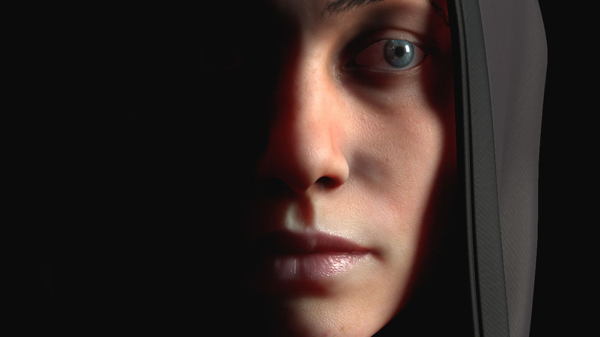

# Subsurface Scattering

{width="500px"}

> 

&#40;Credits : The Soldier,  &#91;by Ribeyrolles Leo&#93;&#40;https://www&#46;artstation&#46;com/artwork/xNYDm&#41;  &#41;

Substance 3D Painter supports  **Subsurface scattering**  both in its  **real-time viewport**  and in the [Iray Renderer](../iray-renderer/iray-renderer.md) .

Subsurface scattering is a mechanism of light when penetrating an object or a surface. Instead of being reflected, like metallic surfaces, a portion of the light is absorbed by the material and then  **scattered inside**  . This behavior is often known under the acronym  **SSS**  for "  **S**  ub  **S**  urface  **S**  cattering". Many materials in real life have subsurface scattering such as skin or wax.

For further details, see the following pages:

* [Enabling Subsurface in a Project](enabling-subsurface-pro/enabling-subsurface-in-a-project.md)
* [Subsurface Parameters](subsurface-parameters/subsurface-parameters.md)
* [Subsurface Material Type](subsurface-material-type/subsurface-material-type.md)
