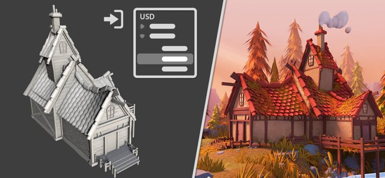

# Universal Scene Description (USD)

USD workflow is available in Painter 8.3. [USD](https://graphics.pixar.com/usd/release/intro.html) was developped by Pixar as a collaboration-friendly interchangable format which allows to carry many different types of data.

In the context of Painter, it is now possible to:

* [Create a project](../../getting-started/project-creation/project-creation.md), making use of USD specific features, such as choice of scope and variants, subdivison levels and animation frames.
* [Export](../../getting-started/export/export-window/export-settings/export-settings.md) materials and textures using the USD format.
* Additionally, USD had been added as a new file format for mesh-only export.
