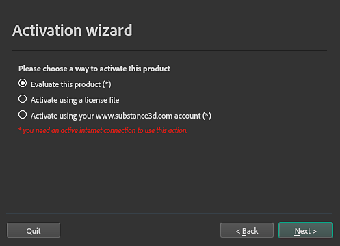

# Activation and licenses

This page has information on how to activate and manage your licenses so you can start using Painter.

## Activation process per application type

The activation process depends on where you purchased or have access to Painter:

| Application Type | Activation process |
| --- | --- |
| Creative Cloud Desktop | See the dedicated page in the [HelpX documentation](https://helpx.adobe.com/download-install/using/download-creative-cloud-apps.html). In case there are any issues the [Creative Cloud documentation](https://helpx.adobe.com/creative-cloud/user-guide.html) may provide additional answers. |
| Steam | Launch the product directly from your Steam library. |
| Substance 3D standalone | See the activation process described below. |

## Standalone Activation steps

### The activation wizard

The Activation wizard appears in certain legacy version of Substance 3D Painter.

If you have a perpetual license file downloaded from the Substance 3D website prior to 30 Sep 2022, you can still use it to activate eligible versions of Substance 3D Painter through the Activation wizard. [More information about legacy Substance licenses and accounts is available here.](https://substance3d.adobe.com/faq-end-of-life-accounts/)

{width="350px"}

The Activation wizard has 3 options:

* <b>Evaluate this product</b>: Legacy trials are no longer available. Instead, [you can start a 30 day trial for each Substance 3D application here](https://www.adobe.com/products/substance3d/free-trial-download.html?msockid=35568f9be2b964ec22d09c04e3eb65af) or with Creative Cloud Desktop.
* <b>Activate using a license file</b>: activate the product with a license file (<b>\*.key</b>) downloaded from your account page on the Substance 3D website before 30 Sep 2022.
* <b>Activate using your account</b>: Legacy substance accounts can no longer be used for activation.

>[!WARNING]
>
> To install the license file with the Activation Wizard, make sure you run Painter as an administrator and temporarily disable your anti-virus.

### Manual activation

You can manually activate Substance Painter by putting the license.key file in the following folder:

>[!NOTE]
>
> Make sure that the file is called **license.key** otherwise the application will not be able to find it.

<table data-preserve-html="true"><colgroup> <col/> <col/> <col/> <col/> </colgroup><tbody><tr><th>Platform</th><th>Version</th><th colspan="2">Path</th></tr><tr><td rowspan="4"><strong>Windows</strong></td><td rowspan="2"><strong>7.2</strong> or newer</td><td colspan="1">App Data (local)</td><td colspan="1">C:&#92;Users&#92;&#91;username&#93;&#92;AppData&#92;Local&#92;Adobe&#92;Adobe Substance 3D Painter</td></tr><tr><td colspan="1">App Data (roaming)</td><td colspan="1">C:&#92;Users&#92;&#91;username&#93;&#92;AppData&#92;Roaming&#92;Adobe&#92;Adobe Substance 3D Painter</td></tr><tr><td rowspan="2">Legacy</td><td colspan="1">App Data (local)</td><td colspan="1">C:&#92;Users&#92;&#91;username&#93;&#92;AppData&#92;Local&#92;Allegorithmic&#92;Substance Painter</td></tr><tr><td colspan="1">App Data (roaming)</td><td colspan="1">C:&#92;Users&#92;&#91;username&#93;&#92;AppData&#92;Roaming&#92;Allegorithmic&#92;Substance Painter</td></tr><tr><td rowspan="2"><strong>Mac</strong></td><td colspan="1"><strong>7.2</strong> or newer</td><td colspan="2">/Users/&#91;username&#93;/Library/Application Support/Adobe/Adobe Substance 3D Painter</td></tr><tr><td colspan="1">Legacy</td><td colspan="2">/Users/&#91;username&#93;/Library/Application Support/Allegorithmic/Substance Painter</td></tr><tr><td rowspan="2"><strong>Linux</strong></td><td colspan="1"><strong>7.2</strong> or newer</td><td colspan="2">/home/&#91;username&#93;/.local/share/Adobe/Adobe Substance 3D Painter</td></tr><tr><td>Legacy</td><td colspan="2">/home/&#91;username&#93;/.local/share/Allegorithmic/Substance Painter</td></tr></tbody></table>

>[!NOTE]
>
> Some of the directories in the paths mentioned above may be hidden by default. Type the path manually in the file explorer or display hidden files to view them.

### Environment variable

You can override the location that Painter checks for the **license.key** file with an [Environment Variable](../../pipeline-and-integration/configuration/environment-variables/environment-variables.md).
