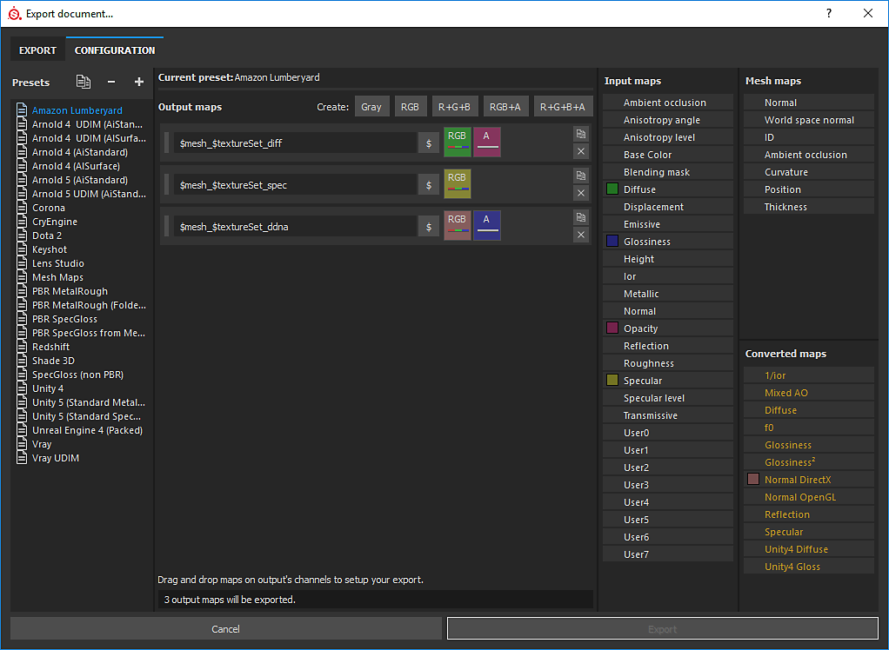
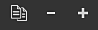
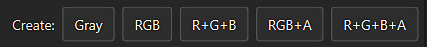
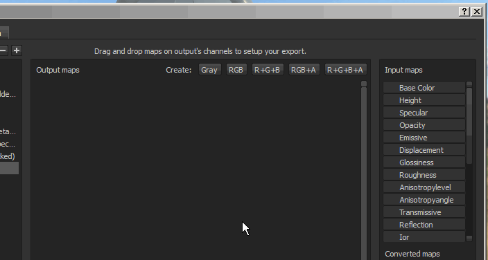
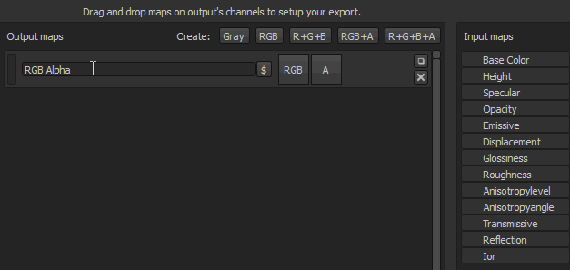
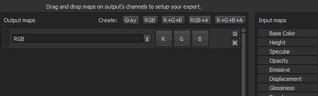

# Creating Output templates

This page explain how to create and modify custom Output templates. Output templates control the naming and configuration of exported textures. Creating a custom Output template gives you the power to configure your exports to perfectly match your workflow.

The configuration tab of the export window is divided into three main parts:

* <b>Preset list:</b> (left) allows to to choose which template to edit or duplicate and rename existing templates.
* <b>Output texture list</b>: (middle) list the content of a selected preset and displays the naming convention and the channel packing options.
* <b>List of Channels</b> and <b>Converted textures</b>: (right)list of channels and textures to use to composite the content of an exported texture.

{width="800px"}

>[!NOTE]
>
> Output templates are saved on the disk as <b>individual files</b> and can be shared with any other user of Substance 3D Painter.  
> You can find the local files for custom templates you have created in the assets/export-presets folder of your [Substance 3D Painter files](../../../pipeline-and-integration/resource-management/shelf-and-assets-location/shelf-and-assets-location.md).

>[!NOTE]
>
> When a template is used to export textures, the template file is automatically included in the project file in subsequent saves.  
> This allows the sharing and/or moving of a project to another computer while maintaining the templates for exporting the textures.  
> Only the last used preset is saved in the project. However if Substance 3D Painter detects a preset that has the same name, the preset inside the project the will be marked as "Outdated" in the list.

## Creating a template

On the top of the preset list, there are three buttons:

* <b> Duplicate</b> : duplicate an existing template.
* <b> Remove</b> : delete any selected template.
* <b> Create</b> : create a new and empty template.

You can also double-click on a template or <b>right-click &gt; rename</b> to change the name of a template.

## Creating output maps

Once a template is selected, it is possible to add new output maps using the dedicated buttons, which are available at the top of the middle section of the window.

Once a map has been created, it is possible to name it and then drag and drop input maps into one of the available channel slots.  
Once an input map has been dropped into the output maps section, a menu will open asking which type of content is to be loaded in that slot.

The options range from <b>RGB</b> and <b>individual</b> channels, to the <b>Alpha</b> and the <b>Grayscale</b> conversion of the input.

>[!NOTE]
>
> Each time an input map is dragged and dropped, a random color will be generated. This provides a visual cue for the channels and the corresponding input map that is loaded.  
> The button also indicates what is loaded into the slot:
> 
> * Background color: indicates which <b>input</b> maps are loaded.
> * RGB bar: indicate that the <b>R</b> , <b>G</b> and <b>B</b> channels from the input map is loaded.
> * Red bar: indicate that the <b>red</b> channel from the input map is loaded.
> * Green bar : indicate that the <b>green</b> channel from the input map is loaded.
> * Blue bar: indicate that the <b>blue</b> channel from the input map is loaded.
> * Gray bar: indicate that the input map is loaded as a <b>grayscale</b> (either from an RGB to Grayscale conversion or because the input is already in grayscale).
> * Black/White line: indicate that the <b>alpha</b> channel from the input map is loaded. In Substance 3D Painter the alpha from an input correspond to the total area painted.

## Naming output maps

Some flags are available to automatically generate the name of the texture during the export process.

* <b> $mesh</b> : name of the mesh file that was loaded in the project
* <b> $textureSet</b> : name of the texture set
* <b> /</b> (forward slash): folder separation

<b> Example</b> : cymourai.fbx with a texture set named "MaterialBase"

* <b>$mesh\_$textureSet\_BaseColor</b> will generate <b>cymourai\_MaterialBase\_BaseColor.png.</b>
* <b>$mesh/$textureSet\_BaseColor</b> will generate a folder named <b>cymourai</b> with a texture named <b>MaterialBase\_BaseColor.png</b> inside of it.

>[!NOTE]
>
> Folders are automatically converted as groups in case the export format is set as  **PSD**  (Photoshop) file format.

## Assigning channels to output maps

It is possible to leave some channels (of the output map) totally empty. In this case case a default color will be assigned.

>[!NOTE]
>
> If a slot refers to a channel that is not present in the Texture set during the export, a default color will also be generated.   
> This color changes depending on the channel which gives the best neutral value.   
>  **Example**  : If missing, the height channel will be generated with a default gray value.

There are different types of maps:

* <b>Input maps</b>: direct channels that can be added in a texture set. Via the TextureSet settings panel.
* <b> Mesh maps</b>: Textures present in the additional map slots of a Texture Set (baked textures).
* <b> Converted maps:</b> virtual textures, these are generated during the export based on the channels present in the document.
  * <b>Normal OpenGL/DirectX</b> : Outputs a normal in the dedicated space by combining the normal from the additional maps, the height and the normal channel.
  * <b>Mixed AO</b>: Combine the Ambient Occlusion additional map with the Ambient Occlusion channel.
  * <b>Diffuse</b>: Diffuse color generated from the BaseColor and Metallic channels (metallic parts will be replaced with a black color).
  * <b>Specular</b>: Specular color generated from the BaseColor and Metallic channels.
  * <b>Glossiness</b>: Inverse of the roughness channel.
  * <b>Unity4 Diffuse</b>: Diffuse color generated from the BaseColor to match Unity4 shaders.
  * <b>Unity4 Gloss</b>: Glossiness generated from the Roughness and Metallic channel to match Unity4 shaders.
  * <b>Reflection</b>: Export a map where white indicate a dielectric materials and other colors for metallic materials
  * <b>1/ior</b>: 1 divided by the ior value, ior is generated from the metallic map : 1.4 for dielectrics, 100 for metals (black color)
  * <b>Glossiness²</b>: Square version of the glossiness channel (Glossiness \* Glossiness)
  * <b>f0</b>: Reflectance value at fresnel 0 (0.04 for dielectrics, 1.0 for metallic)
