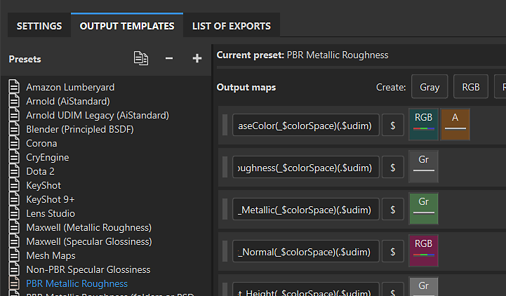

# Output templates

Substance 3D Painter has two types of Output template that can be used to control the behavior of the export process.

* [Default Output templates](default-presets/default-presets.md) are designed to work with specific 3D applications or workflows, and are available in the <b>Output templates tab</b> of the <b>Export window</b>. It's possible to duplicate and modify a Default template or create your own template from scratch.
* [Predefined Output templates](predefined-presets/predefined-presets.md) cannot be modified. Predefined templates appear at the top of the <b>Output template dropdown list</b> on the <b>Settings tab</b> of the <b>Export window</b>.
