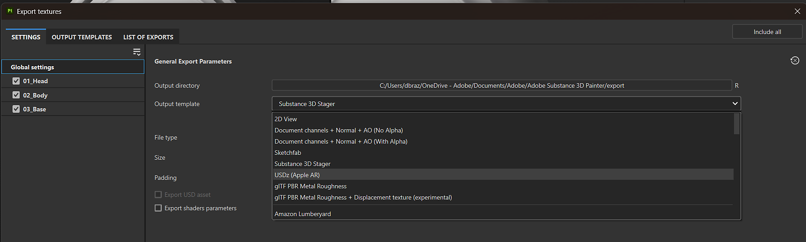
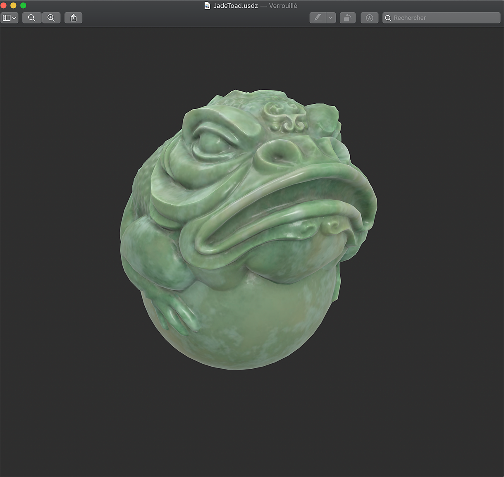
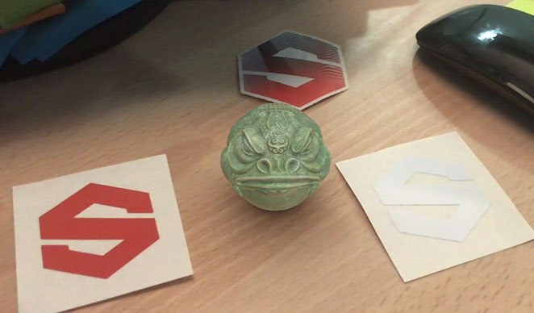

# USDz (Apple AR) predefined template

>[!NOTE]
>
> To export to USD with a custom Output template, do not use the USDz (Apple AR) template. Instead use your chosen Output template, and enable <b>Export USD asset</b> at the bottom of the <b>Settings tab</b>.

The USDz (Apple AR) predefined output template exports your asset configured for use with Apple AR applications.

To use the USDz (Apple AR) template:

1. Open the Export window with <b>File &gt; Export textures</b> or with keyboard shortcut <b>Ctrl + Shift + E</b>.
1. In the <b>Settings tab</b>, open the <b>Output template dropdown</b>, and select <b>USDz (Apple AR)</b>.

{zoomable="yes"}

Five texture files are created and saved (base color, metallic, normal, occlusion and roughness). All files are saved as JPGs except the normal map which is saved as a PNG to avoid artefacts due to lossy compression.

In addition, two other files are created with the extension usdc and usdz:

Here's an example of the JadeToad opened directly in MacOS from Finder:

{width="400px"}

Here's an example of the USDZ file sent to an iPhone, using the AR mode to place the JadeToad model into a real environment:

{width="500px"}
